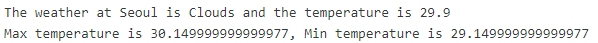

# 20.07.17 오늘 새로 배운점

## 1. 소수점 자르기



> 위와 같이 온도를 출력했을 때, 소수점이 보기 아주 불편하게 나온다.실제 303.1에서 273을 빼는 간단한 뺼셈인데 결과값은 소수점 15번째 자리까지 나오게된다. 왜그럴까?
>
> 이는 컴퓨터는 `0과 1로 소수를 표현하기 때문이다.` 
>
> 10진수에서 1/3을 소수로 나타낸다 했을 때 0.333333처럼 정확하게 나타낼 수 없다.
>
> 마찬가지로 2진수에서 소수를 표현하는 방법은 0.5 + 0.25 + 0.125 + 0.0625 ...이렇게 때문에 정확한 표현이 불가능하다. 이런 비트 방식 표현 때문에 오차가 발생한다


### 불편한 소수점 편하게 보기

[각 언어에서 부동소수 처리하는 방법](https://0.30000000000000004.com/)

> - round(실수,n) 반올림으로 해결
>
>   n을 입력하지 않으면 0으로 default 값이 입력된다.
>
> - f string에서 :.2f
>
> - decimal.Decimal()
>
>   str으로 변환하여 출력하는 decimal 모듈
>
> 

```python

import decimal
number = 3.14592

print(f'round(number)')
print(f'{number:.2f}') 
print(decimal.Decimal(str(number))*3)
```


## 오늘 작성한 코드

### 1번 문제

```python
import random
mylist = ['친구1','친구2','나']
ticket = random.randrange(3)
if mylist[ticket]=='나':
    print('개이득!')

#여기서 문제는 ticket을 쓰지 않아도 되는 것인데 이렇게 바꾸면 된다.

import random
ticket = random.choice(['친구1','친구2','나'])
if ticket=='나':
    print('개이득!')

```

### 2번 문제

```
import random
lucky = sorted(random.sample(range(1,46),6))
if 7 in lucky:
    print('럭키!')
```

## 코스피지수 가져오기

```python
# 아래에 코드를 작성하세요.

# 1. 필요한 모듈을 불러오세요.
import requests
import bs4
# 2. requests 모듈로 요청을 보내세요.
url = 'https://finance.naver.com/sise/'
response = requests.get(url).text
# 3. bs4 모듈로 데이터를 가져오세요.

#BeautifulSoup 문자열을 html 문법에 기반하여 분석을 해주는 역할
data = bs4.BeautifulSoup(response, 'html.parser')
select_kospi = data.select_one('#KOSPI_now')
slect_kospi200 = data.select_one('#KPI200_now')
print(slect_kospi200.text)
```

## 날씨정보 가져오기

```python
# 아래에 코드를 작성하세요.

# 1. 필요한 모듈을 불러오세요.
import requests
# 2. 요청 url을 만드세요.
cities = ['Seoul','Suwon','Pusan']

# 3. 날씨, 현재온도, 최저 및 최고온도에 대한 데이터를 꺼내세요.

# 4. 꺼낸 데이터 값을 기준으로 상태 정보를 출력하세요.
for city in cities:
  url = f'https://api.openweathermap.org/data/2.5/weather?q={city}&appid={key}'
  response = requests.get(url).json()
  weather = response['weather'][0]['main']
  temp = response['main']['temp']-273.15
  temp_min =response['main']['temp_min']-273.15
  temp_max =response['main']['temp_max']-273.15
  print(f'The weather at {city} is {weather} and the temperature is {temp:.1f}')
  print(f'Max temperature is {temp_max:.1f}, Min temperature is {temp_min:.1f}\n')
```

## 인기검색어 가져오기

```python
import requests
import bs4
url_daum = 'https://www.daum.net/'
url_naver = 'https://www.naver.com/'
response_daum = requests.get(url_daum).text
response_naver = requests.get(url_naver).text

data_daum = bs4.BeautifulSoup(response_daum, 'html.parser')
data_naver = bs4.BeautifulSoup(response_naver, 'html.parser')
for i in range(1,3):
  searchRank = data_daum.select_one(f'#wrapSearch > div.slide_favorsch > ul:nth-child(3) > li:nth-child({i}) > a')
  print(searchRank.text)
#for i in range(1,10):
#  searchRank = data_naver.select_one(f'#NM_RTK_VIEW_list_wrap > ul:nth-child(2) > li:nth-child({i}) > a > span')
#  print(searchRank.text)
```

