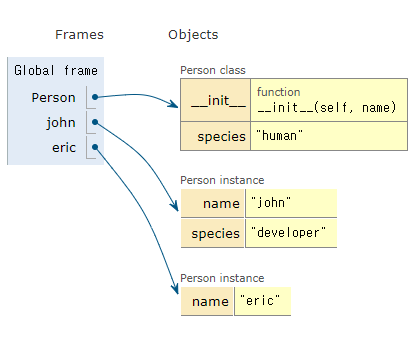

# 0729 오늘 새로 배운점

## 1. 모듈 & 패키지

> - 모듈
>
> 파일 단위의 코드 재사용, 특정 기능을 `.py` 파일 단위로 작성한 것이다.
>
> ```python
> import math
> math.sqrt(5)
> ```
>
> 위의 코드는 파이썬 라이브러리에 있는 `math.py` 모듈을 가져와 그 안에 sqrt 함수를 사용한 것
>
> 
>
> - 패키지
>
> 파일의 모음, 패키지는 점(`.`)으로 구분된 모듈 이름(`package.module`) 을 써서 모듈을 구조화하는 방법
>
> 각 폴더에 `__init__.py` 파일을 통해 파이썬에게 이 폴더는 패키지라는 것을 명시해야 한다. python3.3 버전부터는 `__init__.py` 파일이 없어도 패키지로 인식한다
>
> ```python
> # my_package/math/tools.py
> from my_package.math import tools
> print(tools.my_max(1,2))
> print(dir(tools))
> # 실행결과
> # 2
> # ['__builtins__', '__cached__', '__doc__', '__file__', '__loader__', '__name__', '__package__', '__spec__', 'e', 'my_max', 'pi']
> ```
>
> ```python
> from my_package.math.tools import my_max
> my_max(1,2)
> # 실행결과
> # 2
> ```
>
> 이처럼 패키지의 모듈안 함수를 `import` 하여 `moudle.func()` 형태가 아니라 함수의 이름으로 바로 사용할 수 있다
>
> ```python
> from module import *
> ```
>
> 해당하는 모듈 내의 함수를 모두 변수, 함수, 클래스를 불러온다
>
>   ```python
> from module import 변수, 함수, 클래스 as 별명
>   ```
>
> 자신이 지정하는 이름으로 데이터를 불러올 수 있다

## 2. 객체지향프로그래밍 (OOP, 객체중심프로그래밍)

- 코드의 직관성
- 활용의 용이성
- 변경의 유연성
- 객체 지향 프로그래밍은 컴퓨터 프로그램을 명령어의 목록으로 보는 시각에서 벗어나 여러 개의 독립된 단위, 즉 "객체"들의 모임으로 파악하고자 하는 것

> ### 2.1 객체
>
> 파이썬에서 모든 것은 객체(Object), 모든 객체는 타입(type), 속성(attribute), 조작법(method)을 가진다.
>
> - 타입(type) : 어떤 연산자와 조작 가능한가
> - 속성(attribute) : 어떤 상태(데이터)를 가지는가
> - 조작법(method) : 어떤 행위(함수)를 할 수 있는가
>
> 
>
> ### 2.2 타입(type)과 인스턴스(instance)
>
> - 타입(type) : 공통된 속성(attribute)과 조작법을 가진  객체들의 분류
> - 인스턴스(instance) : 특정 (type)의 실제 데이터 예시(intance), 파이썬에서 모든 것은 객체이고 모든 객체는 특정 타입의 인스턴스이다
>
> 
>
> ### 2.3 클래스(Class)와 객체(Object)
>
> ​	`type`: 공통 속성을 가진 객체들의 분류(class)
>
> ​	`class`: 객체들의 분류(class)를 정의할 때 쓰이는 키워드
>
> 
>
> - 클래스 생성
>
> ```python
> class <클래스이름>:
>     <메소드>
> class ClassName:
>     methods
> ```
>
> 클래스 내부에 데이터와 함수를 정의할 수 있고, 이때 정의된 함수는 메서드(method)로 불린다
>
> ```python
> class Person:
>     """
>     이것은 Person 클래스(class)입니다.
>     """
> p1 = Person()
> print(p1.__doc__)
> 
> # 실행결과
> #     이것은 Person 클래스(class)입니다.
> ```
>
> 클래스 정의 아래에 쓴 multi line string은 클래스에 대한 설명을 적고, `__doc__`을 통해 출력한다
>
> 
>
> - 인스턴스 생성
>
> ```python
> # 인스턴스 = 클래스()
> p1 = Person()
> ```
>
> `p1`은 사용자가 정의한 `Person`이라는 데이터 타입의 인스턴스이다
>
> 
>
> - 메서드(Method) 정의
>
> 특정 데이터 타입(또는 클래스)의 객체에 공통적으로 적용 가능한 행위들을 의미,  메서드도 함수의 인자와 동일하게 기본 인자, 가변 인자 리스트 등 매개변수를 정의할 수 있다
>
> ```python
> class Person:
>     def greet(self,time=1):
>         return '안녕'*time
>     
> p1 = Person()
> p1.greet()
> 
> # 실행결과
> # '안녕'
> ```
>
> - 생성자(constructor) 메서드
>
> 인스턴스 객체가 생성될 때 호출되는 함수
>
> ```python
> def __init__(self):
>     print('생성될 때 자동으로 호출되는 메서드')
> ```
>
> 
>
> - 소멸자(destructor) 메서드
>
> 인스턴스 객체가 소멸되기 직전에 호출되는 함수
>
> ```python
> class Person:
>     def __init__(self):
>         print('constructor!')
>         
>     def __del__(self):
>         print('destructor!')
> 
> p1 = Person()
> p1 = 'Hello'
> 
> # 실행결과
> # constructor!
> # destructor!
> ```
>
> 
>
> - 속성(attribute) 정의
>
> 특정 데이터 타입(또는 클래스)의 객체들이 가지게 될 상태/데이터를 의미한다
>
> ```python
> class Person:
>     def __init__(self, name):
>         self.name = name
> 
>     def greet(self):
>         return f'안녕, 나는 {self.name}'
> me = Person('Python')
> print(me.name)
> print(me.greet())
> 
> # 실행결과
> # Python
> # 안녕, 나는 Python
> ```
>
> 
>
> - `self` 인스턴스 자신
>
> Python에서 메서드는 호출 시 첫번째 인자로 인스턴스 자신이 전달되게 설계되었다 
>
> 
>
> ### 2.4 인스턴스 & 클래스 변수
>
> - 인스턴스 변수
>
>   인스턴스의 속성
>
>   인스턴스들의 고유한 변수 (데이터)
>
>   메서드 정의에서 `self.변수명`으로 정의
>
>   인스턴스가 생성된 후  `인스턴스.변수명`으로 접근 및 할당
>
>   
>
> - 클래스 변수
>
>   클래스의 속성
>
>   해당 클래스의 모든 인스턴스가 공유
>
>   클래스 정의 내부에서 선언
>
>   `클래스.변수명` 또는 `인스턴스.변수명`으로 접근 및 할당
>
> ```python
> class Person:
> 	species = 'human'			 # 클래스 변수
>     def __init__(self, name):    # 인스턴스 메서드 (생성자) 
>         self.name = name         # 인스턴스 변수
> ```
>
> ```python
> class Person:
>     species = 'human'
>     
>     def __init__(self, name):
>         self.name = name
> john = Person('john')
> eric = Person('eric')
> print(Person.species)
> print(john.species)
> print(eric.species)
> john.species = 'developer'
> print(john.species)
> print(eric.species)
> 
> # 실행결과
> # human - print(Person.species)
> # human - print(john.species)
> # human - print(eric.species)
> # developer - print(john.species)
> # human - print(eric.species)
> ```
>
> 
>
> ### 2.5 인스턴스 & 클래스 메서드 (+스태틱 메서드)
>
> - 인스턴스 메서드
>
>   인스턴스가 사용할 메서드
>
>   클래스 내부에 정의되는 메서드의 기본값은 인스턴스 메서드
>
>   호출시, 첫 번째 인자로 인스턴스 자기자신 `self` 가 전달된다
>
> 
>
> - 클래스 메서드
>
>   클래스가 사용할 메서드
>
>   `@classmethod` 데코레이터를 사용하여 정의
>
>   호출시, 첫 번째 인자로 클래스 `cls`가 전달된다
>
> 
>
> - 스태틱 메서드
>
>   클래스가 사용할 메서드
>
>   `@staticmethod` 데코레이터를 사용하여 정의
>
>   호출시, 어떠한 인자도 전달되지 않는다
>
> 
>
>  클래스 메서드는 메서드 안에서 클래스 속성, 클래스 메서드에 접근해야 할 때 사용하며 그렇지 않을 경우 정적 메서드를 사용한다.
>
> 
>
> ```python
> class Puppy:
>     population = 0
>     
>     def __init__(self, name, breed):					
>         self.name = name
>         self.breed = breed
>         Puppy.population += 1
>         
>     def __del__(self):
>         Puppy.population -= 1
>     
>     def bark(self):
>         return f'왈왈! 나는{self.name}, {self.breed}(이)야'
>     
>     @classmethod
>     def get_population(cls):
>         return f'현재 강아지 마리수: {cls.population}'
>     
>     @staticmethod
>     def info():
>         return '이것은 Puppy 클래스입니다!'
> #
> choco = Puppy('초코', '푸들')
> 
> # instance method
> print(choco.bark())
> 
> # static method
> print(choco.info(), Puppy.info())
> 
> # class method
> print(Puppy.get_population())
> print(choco.get_population())
> 
> # 실행결과
> # 왈왈! 나는초코, 푸들(이)야
> # 이것은 Puppy 클래스입니다! 이것은 Puppy 클래스입니다!
> # 현재 강아지 마리수: 1
> # 현재 강아지 마리수: 1
> ```
>
> 
>
> - 이름 공간 원칙
>
>   인스턴스에서 변수의 이름을 조회를 할 수 없다면, 클래스 객체의 데이터를 조회한다.
>
>   즉, 인스턴스 => 클래스 (=> 상위 클래스) 순으로 탐색을 한다.
>
> ```python
> class Person:
>     name = '홍길동'
> 
>     def talk(self):
>         return f'안녕, 나는 {self.name}'
> p1 = Person()
> print(p1.talk())
> 
> p1.name = 'john'
> print(p1.talk())
> 
> # 실행결과
> # 안녕, 나는 홍길동 - p1.name를 조회할 수 없기 때문에 클래스 변수에 할당된 '홍길동' 호출
> # 안녕, 나는 john - p1.name = 'john'
> ```
>
> 
>
> ### 2.6 상속
>
> 클래스의 가장 큰 특징 상속
>
> 부모 클래스의 모든 속성이 자식 클래스에게 상속 되므로 코드 재사용성이 높아진다
>
> 코드를 중복하여 정의하지 않아도 된다. 
>
> ```python
> class ChildClass(ParentClass):
>     <code block>
> ```
>
> 
>
> - `super()`
>
>   자식 클래스에 메서드를 추가로 구현할 수 있다
>
>   부모 클래스의 내용을 사용하고자 할 때 사용한다
>
> ```python
> class ChildClass(ParentClass):
>     def method(self, arg):
>         super().method(arg) 
> ```
>
> 
>
> ### 2.7 메서드 오버라이딩
>
> Method Overriding (메서드 재정의), 자식 클래스에서 부모 클래스의 메서드를 재정의하는 것
>
> 상속 받은 클래스에서 같은 이름의 메서드로 덮어쓴다
>
> ```python
> class Person:
>     def __init__(self, name, age, number, email):
>         self.name = name
>         self.age = age
>         self.number = number
>         self.email = email 
>         
>     def greeting(self):
>         print(f'안녕, 나는 {self.name}')
>         
>         
> class Student(Person):
>     def __init__(self, name, age, number, email, student_id):
>         super().__init__(name, age, number, email)
>         self.student_id = student_id
>         
>     # <-- 메서드 오버라이딩
>     def greeting(self): 
>         print(f'안녕, 나는 {self.name} {self.student_id}')
>         
> p1 = Person('홍길동', 200, '0101231234', 'hong@gildong')
> s1 = Student('학생', 20, '12312312', 'student@naver.com', '190000')
> 
> p1.greeting()
> s1.greeting()
> 
> # 실행결과
> # 안녕, 홍길동
> # 안녕, 나는 학생 190000
> ```
>
> 
>
> ### 2.8 다중 상속
>
> 두개 이상의 클래스를 상속받는 경우, 다중 상속이 된다
>
> ```python
> #
> class Person:
>     def __init__(self, name):
>         self.name = name
> 
>     def greeting(self):
>         return f'hi, {self.name}'
> #
> class Girl(Person):
>     gene = 'XX'
>     
>     def swim(self):
>         return '첨벙첨벙'
> #
> class Boy(Person):
>     gene = 'XY'
>     
>     def walk(self):
>         return '성큼성큼'
> #
> class FisrtFriend(Girl, Boy):  # 상속의 순서가 중요합니다.(왼쪽에서 오른쪽). gene은 Dad의 gene값을 가져오게 됩니다.
>     def swim(self):  
>         return '챱챱'
>        
>     def cry(self):  
>         return '응애'
>     
> class SecondFriend(Boy, Girl):  # 상속의 순서가 중요합니다.(왼쪽에서 오른쪽). gene은 Dad의 gene값을 가져오게 됩니다.
>     def swim(self):  
>         return '챱챱'
>        
>     def cry(self):  
>         return '응애'
> p1 = FisrtFriend('친구1')
> print(p1.gene)
> p2 = SecondFriend('친구2')
> print(p2.gene)
> 
> # 실행결과
> # XX
> # XY
> ```


```sh
which python
which python | clip 
```

