# 0812

> ## 1.Float
>
> Float된 이미지 좌,우측 주변으로 텍스트를 둘러싸는 레이아웃을 위해 도입, 더 나아가 이미지가 아닌 다른 요소들에도 적용해 웹 사이트의 전체 레이아웃을 만들 수 있음
>
> 속성으로 `none` `left` `right` 가 있다.
>
> 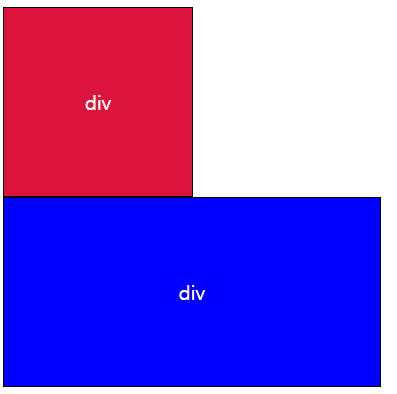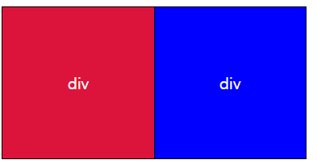
>
> ```html
> <body>
>   <div class="box1" style="float:left">div</div>
>   <div class="box2">div</div>
> </body>
> ```
>
> 
>
> float : left를 적용했을 때, 빨간 블럭 밑으로 파란 블럭이 존재하게 된다.  빨간색 블럭이 body로부터 떨어져 나와 자유로운 상태이기 때문에 저런 현상이 발생. 
>
> 이런 현상을 막기 위해서 float 속성을 적용한 요소에 내용이 빈 부모를 인위적으로 만들어 방지한다. 
>
> ```css
> .clearfix::after {
>     content: "";
>     display: block;
>     clear : both;
> }
> ```
>
> ```html
> <header class="clearfix">
>     <div class="box1" style="float:left">div</div>
> </header>
> <div class="box2">div</div>
> ```


> ## 2. Flexbox
>
> 요소 간 공간 배분과 정렬 기능
>
> 요소
>
> - Flex Container
> - Flex item
>
> 축
>
> - main axis
> - cross axis
>
> 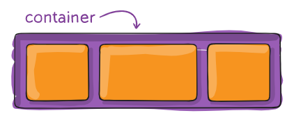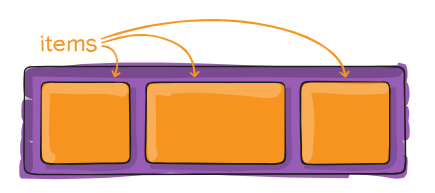
>
> flex box의 시작은 부모 요소에 `display : flex`로 시작한다. 
>
> 속성으로
>
> - flex-direction(배치 방향 설정)
> - justify-content(메인 축 방향 정렬),
> - align-items(한 줄), align-content(여러 줄), align-self(개별요소) (교차 축 방향 정렬)
> - flex-wrap, flex-flow, flex-grow
>
> 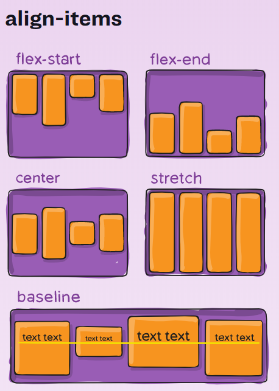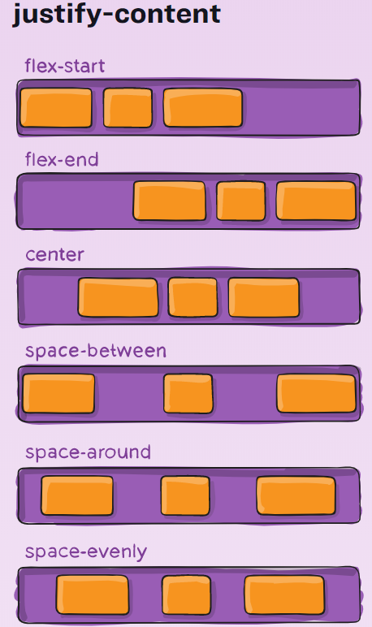
>
> ```html
> <div class="box1 flex-container">
>     <div class="box2 item1">1</div>
>     <div class="box2 item2">2</div>
>     <div class="box2 item3">3</div>
> </div>
> ```
>
> ```css
> .flex-container {
>     display : flex; 
>     flex-direction: row;
> }
> ```
>
> 순서대로 justify-content : flex-start, flex-end, center
>
> 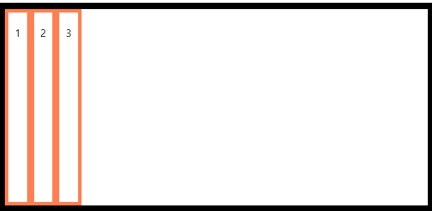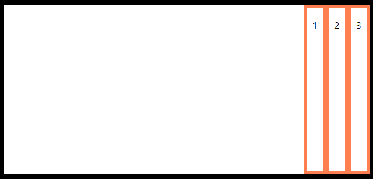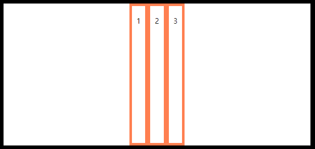
>
> 순서대로 align-items : flex-start, flex-end, center
>
> 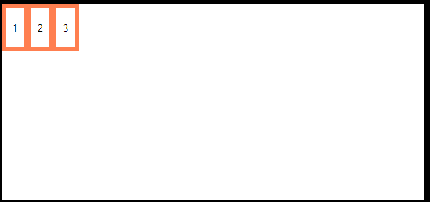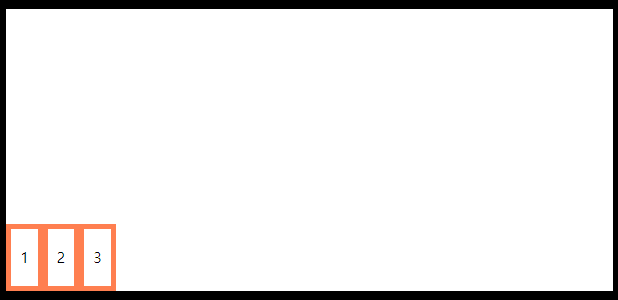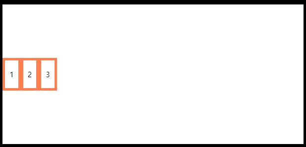
>
> 


> ## 3. Bootsrap
>
> The most popular HTML, CSS, and JS library in the world.
>
> 웹 페이지에서 많이 쓰는 요소들을 내장하고 있다. 디자인 할 시간을 줄여준다.
>
> one source -> multi use 반응형 웹 디자인을 추구, 하나의 웹사이트를 구축하여 다양한 디바이스 화면 해상도에서 제공할 수 있도록 만든다.
>
> ### Grid system
>
> 화면 픽실에 따라 차지하는 col의 수를 조정하여 다양한 디바이스의 화면에 적용 가능 , 이때 col은 약수가 가장 많은 12를 기준으로 한다.
>
> ```html
> <div class="row">
>     <div class="box col-2 col-sm-4 col-md-8">1</div>
>     <div class="box col-8 col-sm-4 col-md-2">2</div>
>     <div class="box col-2 col-sm-4 col-md-2">3</div>
> </div>
> ```
>
> 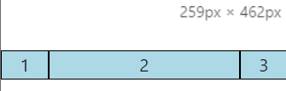
>
> 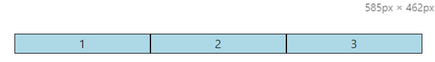
>
> 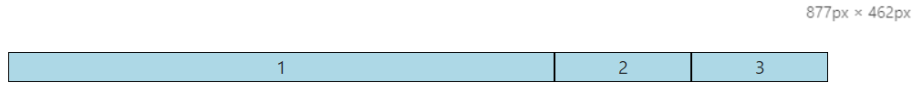

자료출처 : [flexbox 사진](https://css-tricks.com/snippets/css/a-guide-to-flexbox/)