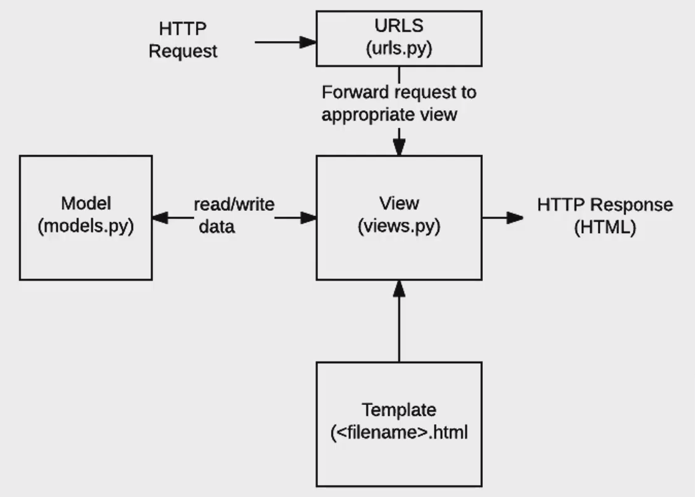

# 0814

django : python web framework

web framework 

- 웹 페이지를 개발하는 과정에서 겪는 어려움을 줄이는 것이 주 목적 
- 기본적인 구조나 코드들은 제공해준다

why django?

- spotify, instagram, dropbox, delivery hero

MVC - MTV

model view controller - model template view

model - 데이터 관리, template - 인터페이스, view - 중간 관리

## 1. django 시작

django-admin -startproject {name} (name을 first_project로 설정했다)

- 실행하면 {name} 이름을 가진 폴더가 생기고 그 안에 똑같은 이름을 가진 폴더가 하나 더 생긴다.
- manage.py을 실행한다.

`python manage.py runserver`

`__init__.py`

first_project를 패키지의 모듈화?

빈 파일이다.

코드 작성 순서 -> 데이터 흐름

1. app 생성

   `python manage.py startapp {names}` 앱의 이름은 복수형으로 ( name = articles로 설정)

   articles 폴더에 templates 폴더를 생성하고 그 안에 html 파일 생성

2. app 등록

   app을 등록하기 위해서 `settings.py` - `INSTALLED_APPS` 배열의 위쪽에 추가해준다

3. `urls.py`

4. `views.py`

5. `templates`

### 1.1 variable routing

> urls.py에서 `  path('hello/<str:name>/')` 
>
> views.py 에서 `def hello(request,name):`

### 1. 2 Django Template Language (DTL)

> django template system에서 사용하는 built-in template system이다
>
> 조건 반복 치환 필터 변수 등의 기능을 제공한다
>
> 프로그래밍적 로직이 아니라 프로젠테이션을 표현하기 위한 것
>
> ### Syntax
>
> - variable : {{variable}}
>
> - filter : {{variavle|filter}}
>
> - tags : 
>
>   