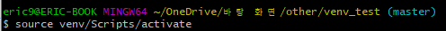
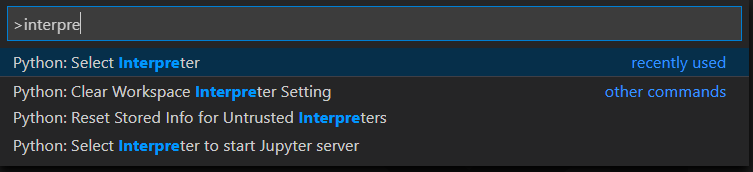
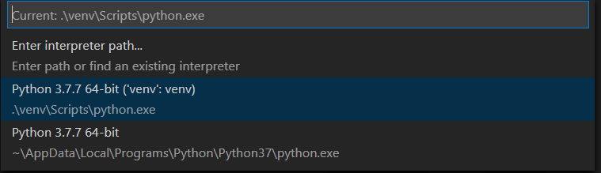
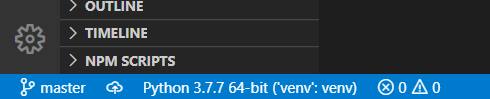
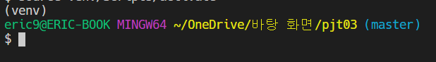
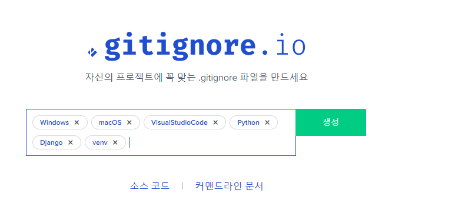

## 가상환경

>  파이썬 인터프리터, 라이브러리, 스크립트가 "시스템 파이썬" (즉, 운영 체제 일부로 설치되어 있는 것)에 설치된 모든 라이브러리와 분리 되어있는 파이썬 환경이다. 
>
> 각 가상 환경을 고유한 파이썬 환경을 가지며 독립적으로 설치된 패키지 집합을 가진다.
>
> **Why?**
>
> 여러 프로젝트를 진행하게 되면 서로 다른 버전의 라이브러리가 필요할 수도 있고,  각 라이브러리나 모듈은 서로에 대한 의존성이 다르기 때문에 알 수 없는 충돌이 발생 가능하다.

### VENV

> ```bash
> $ python -m venv/[가상환경이름] 
> $ source venv/Scripts/activate
> ```
>
> 가상환경 이름은 보통 venv를 사용한다
>
> 
>
> 
>
> ### 가상환경 in VSCode
>
> 1. `ctrl` + `shift` + `p` -> `python interpreter` 선택
>
> 
>
> 2. 활성화 할 가상환경 선택
>
> 
>
> 3. vscode 좌측하단 확인
>
> 
>
> 4. terminal 확인
>
> 


### pip freeze(패키지 관리)

>- 개발 환경이 바뀌거나 (집과 교육장 왔다갔다하거나), 협업을 하게 됐을 때 개발 중인 환경을 온전히 넘겨 줘야 할 때가 있다.
>- 이를 위해 개발 환경을 기록하고 이를 새로운 환경에서도 한번에 이식할 수 있는 방법!
>
>
>
>**패키지 요구사항 파일 생성**
>
>- 현재 환경에 설치된 패키지를 `requirements.txt`에 대소문자를 구분하지 않은 순서로 나열한다
>
>```bash
>$ pip freeze > requirements.txt
>```
>
>
>
>**패키지 요구사항 설치**
>
>- 다른 사람이 나의 프로젝트를 사용하려면 가상환경에서 `requirements.txt`에 설치되어 있는 패키지를 다 받아야한다.
>
>```bash
>$ pip install –r requirements.txt
>```


##  Fixture

Django가 데이터베이스로 import 할 수 있는 데이터 모음

앱을 처음 설정할 때 데이터베이스를 미리 채워야 하는 상황이 존재하는데, 이러한 초기 데이터를 제공하는 방법 중 하나

- **dumpdata**
  
  - 특정 앱의 관련된 데이터베이스의 모든 데이터를 출력
  
- 명령어

  ```bash
  $ python manage.py dumpdata app_name.ModelName [--options]
  ```

  ex)   ` $ python manage.py dumpdata articles.Article --indent 4 > articles.json `

  ​		`$ python manage.py  dumpdata auth.User --indent 4 > users.json`

  

- **loaddata**

  - dumpdata를 통해 만들어진 fixtures 파일을 데이터베이스에 import
  - fixtures 파일은 반드시 app 디렉토리 안에 fixtures 디렉토리에 위치해야 한다.

- 명령어

  ```bash
  $ python manage.py loaddata fixtures_path
  ```

  ex) 	`$ python manage.py loaddata articles/articles.json`




## .gitignore.io

프로젝트를 pulic하게 올리기 위해서는 올리지 말아야할 파일, 폴더들이 있다. 그것을 자동적으로 설정해주는 사이트

