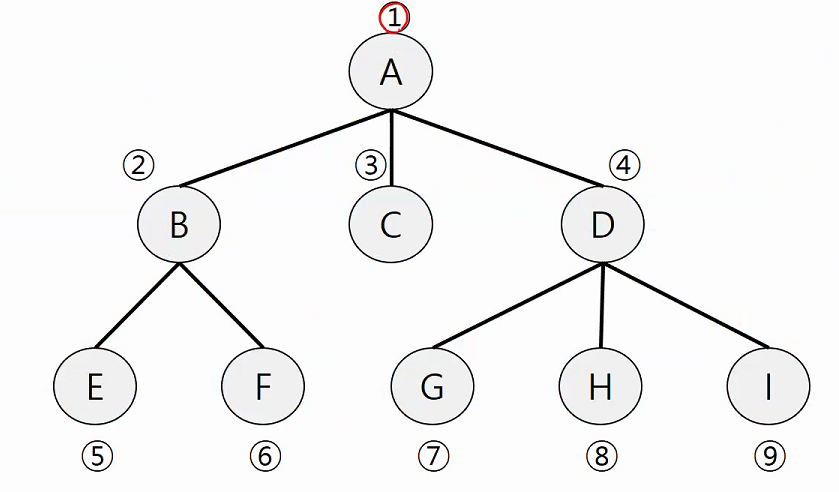

## 1. Priority Queue (Heap)

> **힙**(heap)은 최댓값 및 최솟값을 찾아내는 연산을 빠르게 하기 위해 고안된 완전이진트리(complete binary tree)를 기본으로 한 자료구조(tree-based structure)
>
> 힙 구현
>
> ```python
> class Heap():
>     def __init__(self):
>         self.tail = 0
>         self.arr = []
> 
> 
>     def swap(self,l,r):
>         self.arr[l],self.arr[r] = self.arr[r],self.arr[l]
> 
> 
>     def leftchild(self,i):
>         if 2*i+1 < self.tail:
>             return 2*i+1
>         return None
> 
> 
>     def rightchild(self,i):
>         if 2*i+2 < self.tail:
>             return 2*i+2
>         return None
> 
> 
>     def push(self,item):
>         self.arr.append(item)
>         cur_idx = self.tail
>         self.tail +=1
>         while (cur_idx-1)//2>=0 and self.arr[cur_idx]>self.arr[(cur_idx-1)//2]:
>             self.swap(cur_idx,(cur_idx-1)//2)
>             cur_idx = (cur_idx-1)//2
> 
> 
>     def pop(self):
>         if self.tail > 0:
>             item = self.arr[0]
>             parent = 0
>             self.tail -= 1
>             self.swap(0,self.tail)
>             del self.arr[self.tail]
> 
>             while True:
>                 tmp = parent
>                 left = self.leftchild(parent)
>                 right = self.rightchild(parent)
>                 if left != None and self.arr[left]>self.arr[parent]:
>                     parent = left
>                 if right !=None and self.arr[right]>self.arr[parent]:
>                     parent = right
>                 if tmp != parent:
>                     self.swap(tmp,parent)
>                 else:break
>             return item
> 
> 
>     def print_heap(self):
>         cnt = 1
>         for i in range(len(self.arr)):
>             print(self.arr[i],end=' ' )
>             if i+1 >= 2**cnt-1:
>                 print()
>                 cnt+=1
>         print()
> 
> 
> heap = Heap()
> 
> for i in range(1,20):
>     heap.push(i)
> 
> heap.print_heap()
> 
> for i in range(1,20):
>     print(heap.pop(),end=' ')
> '''
> 19 
> 18 14 
> 17 9 11 13 
> 10 16 3 8 2 6 5 12 
> 1 7 4 15 
> 19 18 17 16 15 14 13 12 11 10 9 8 7 6 5 4 3 2 1 
> '''
> ```
>
> 

## 2. BFS (Breadth First Search)

> 
>
> Queue 에 쌓이는 구조를 보면 , ` [1]` -> `[2.3.4]` -> `[3,4,5,6,]` -> `[4,5,6]` -> `[5,6,7,8,9]` 순서로 나아간다. 이 때 visited를 잘 설정하여 root node로 부터의 거리를 표현할 수 있다. 
>
> ```python
> def bfs(v):
>     visited_order.append(v)
>     Q.append(v)
>     visited[v] = 1
>     while Q:
>         v=Q.pop(0)
>         for w in range(1,V+1):
>             if w in linked[v] and visited[w] == 0:
>                 Q.append(w)
>                 visited[w] = visited[v] +1
>                 visited_order.append(w)
> 
> V,E = map(int,input().split())
> lines = list(map(int,input().split()))
> linked = [[] for _ in range(V+1)]
> visited = [0] * (V+1)
> visited_order = []
> Q = []
> for i in range(E):
>     v,w = lines[2*i],lines[2*i+1]
>     linked[v].append(w)
>     linked[w].append(v)
> 
> bfs(1)
> print(linked)
> print(visited)
> print(visited_order)
> #[[], [2, 3, 4], [1, 5, 6], [1], [1, 7, 8, 9], [2], [2], [4], [4], [4]]
> #[0, 1, 2, 2, 2, 3, 3, 3, 3, 3]
> #[1, 2, 3, 4, 5, 6, 7, 8, 9]
> ```

