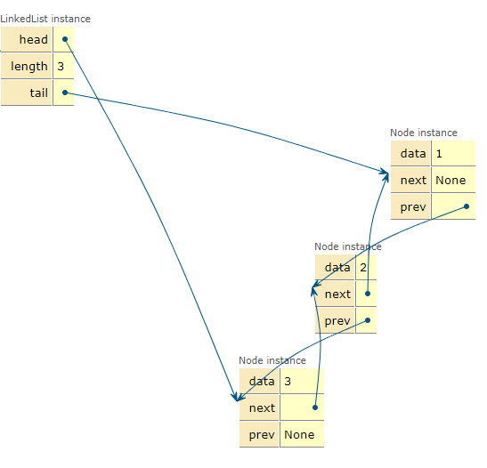

## 1. Doubley LinkedList

> queue와 stack 두 가지 특성을 모두를 합쳐 놓은 자료구조
>
> ```python
> '''
> push_front X: 정수 X를 덱의 앞에 넣는다.
> push_back X: 정수 X를 덱의 뒤에 넣는다.
> pop_front: 덱의 가장 앞에 있는 수를 빼고, 그 수를 출력한다. 만약, 덱에 들어있는 정수가 없는 경우에는 -1을 출력한다.
> pop_back: 덱의 가장 뒤에 있는 수를 빼고, 그 수를 출력한다. 만약, 덱에 들어있는 정수가 없는 경우에는 -1을 출력한다.
> size: 덱에 들어있는 정수의 개수를 출력한다.
> empty: 덱이 비어있으면 1을, 아니면 0을 출력한다.
> front: 덱의 가장 앞에 있는 정수를 출력한다. 만약 덱에 들어있는 정수가 없는 경우에는 -1을 출력한다.
> back: 덱의 가장 뒤에 있는 정수를 출력한다. 만약 덱에 들어있는 정수가 없는 경우에는 -1을 출력한다.
> '''
> 
> 
> class Node:
>     def __init__(self,data):
>         self.data = data
>         self.prev = None
>         self.next = None
> 
> class LinkedList:
>     def __init__(self):
>         self.head = None
>         self.tail = None
>         self.length = 0
> 
>     def push_front(self,data):
>         new_node = Node(data)
>         if self.length==0:
>             self.head = new_node
>             self.tail = new_node
>         else:
>             new_node.next = self.head
>             self.head.prev = new_node
>             self.head = new_node
>         self.length+=1
> 
> 
> 
>     def push_back(self,data):
>         new_node = Node(data)
>         if self.length==0:
>             self.head = new_node
>             self.tail = new_node
>         else:
>             new_node.prev = self.tail
>             self.tail.next = new_node
>             self.tail = new_node
>         self.length+=1
> 
>     def pop_front(self):
>         if self.length==0:
>             return -1
>         else:
> 
>             item = self.head.data
>             tmp = self.head.next
>             del self.head
>             self.head = tmp
>             if self.length != 1:
>                 tmp.prev = None
>             self.length -= 1
> 
>             return item
> 
> 
>     def pop_back(self):
>         if self.length==0:
>             return -1
>         else:
>             item = self.tail.data
>             tmp = self.tail.prev
>             del self.tail
>             self.tail = tmp
>             if self.length != 1:
>                 tmp.next = None
>             self.length-=1
>             return item
> 
> 
>     def size(self):
>         return self.length
> 
> 
>     def empty(self):
>         if self.length==0:
>             return 1
>         else:
>             return 0
> 
> 
>     def front(self):
>         if self.length == 0:
>             return -1
>         return self.head.data
> 
> 
>     def back(self):
>         if self.length == 0:
>             return -1
>         return self.tail.data
> 
> 
>     def print(self):
>         tmp = self.head
>         while tmp != None:
>             print(tmp.data,end=' ')
>             tmp=tmp.next
>         print()
> 
>         
> Q =LinkedList()
> 
> for i in range(3):
>     Q.push_front(i+1)
> Q.print()
> ```
>
> 
>
> 
>
> 