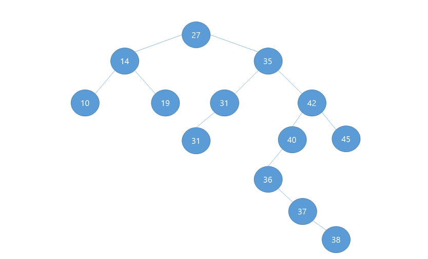

## 이진트리탐색 (Binary Search Tree) 

> 
>
> [사진 출처](https://oneshottenkill.tistory.com/435)
>
> 이진트리에서 삽입과 탐색은 어렵지 않게 구현 가능하다. 하지만, 삭제는 조금 복잡했다.
>
> 삭제하는 경우 3가지의 Case가 있다. 
>
> 1. 삭제할 노드의 자식 노드가 없는 경우
>
>    이런 경우는 아주 감사한 경우다.. 삭제할 노드를 없애버리면 끝이다! 
>
> 2. 삭제할 노드의 자식 노드가 1개인 경우
>
>    이 경우도 어렵지 않다. 삭제할 노드의 자식 노드와 부모 노드를 서로 이어주면 된다!
>
> 3. 삭제할 노드의 자식 노드가 2개인 경우
>
>    이게 조금 복잡하다. 
>
>    삭제할 노드 N의 왼쪽 subtree를 A, 오른쪽 subtree를 B라 하면, 나는 B의 노드 중 가장 작은 노드 M을 골라  N과 바꿔치기 했다. 하지만 이때  M의 오른쪽 자식 노드가 있을 수 있는데, 위의 그림에서 `35 노드` 를 제거하는 경우가 그렇다.
>
> `35 노드`를 제거하기 위해서 subtree B에서 가장 작은 노드 M으로 향한다. M은 `36 노드` 이다. 이떄 M의 오른쪽 자식 노드가 있기 때문에, 바꿔치기를  한 번에 수행할 수 없다. 
>
> 1. M의 부모 노드와 M의 오른쪽 자식 노드를 이어준다
> 2. 삭제할 노드 N의 subtree A를 M의 왼쪽 자식 노드로 이어준다.
> 3. 삭제할 노드 N의 subtree B를 M의 오른쪽 자식 노드로 이어준다.
> 4. 삭제할 노드 N의 부모 노드를 M과 이어준다.
>
> ```python
> class Node:
>     def __init__(self,data):
>         self.left=None
>         self.right=None
>         self.data = data
> 
> 
> class BinarySearchTree:
>     def __init__(self):
>         self.root = None
> 
> 
>     def insert(self,data):
>         self.root = self.check_insert_left_right(self.root,data)
> 
> 
>     def check_insert_left_right(self,node,data):
>         if node == None:
>             node=Node(data)
>         else:
>             if node.data > data:
>                 node.left = self.check_insert_left_right(node.left,data)
>             else:
>                 node.right = self.check_insert_left_right(node.right,data)
>         return node
> 
> 
>     def search(self,data):
>         cur_node = self.root
>         if cur_node == None:
>             return False
>         else:
>             while cur_node != None:
>                 if cur_node.data > data:
>                     cur_node=cur_node.left
>                 elif cur_node.data < data:
>                     cur_node=cur_node.right
>                 else:
>                     return True
>             return False
> 
> 
>     def print(self):
>         cur_node = self.root
>         self.recur(cur_node)
>         print()
> 
>     def recur(self,node):
>         if node == None:
>             return
>         self.recur(node.left)
>         print(node.data,end=' ')
>         self.recur(node.right)
> 
>     #삭제하는 노드의 오른쪽 subtree에서 가장 작은 값을 가지는 노드 B
>     #만약 B 노드의 자식 노드가 있다면, B 노드의 부모 노드 C와 이어준다.
>     #즉 C left -> B right
>     def delete(self,data):
>         if not self.search(data):
>             return False
>         self.root = self.check_delete_node(self.root,data)
>         return True
> 
> 
>     def check_delete_node(self,node,delete_data):
>         if delete_data == node.data:
>             if node.left and node.right: #삭제 노드의 자식 노드가 2개
>                 #오른쪽 subtree의 가장 작은 노드를 찾는다.
>                 parent_of_small_node, small_node = node,node.right
>                 while small_node.left:
>                     parent_of_small_node = small_node
>                     small_node = small_node.left
>                 small_node.left =node.left
>                 if parent_of_small_node!=node:# subtree에서 움직였다면
>                     parent_of_small_node.left = small_node.right
>                     small_node.right = node.right
>                 node = small_node
> 
>             elif node.left or node.right: #삭제 노드의 자식 노드가 1개
>                 node = node.left or node.right
>             else:
>                 node = None
>         else:
>             if node.data > delete_data:#왼쪽 탐색
>                 node.left=self.check_delete_node(node.left,delete_data)
>             else:#오른쪽탐색
>                 node.right=self.check_delete_node(node.right,delete_data)
>         return node
> 
> 
> bst = BinarySearchTree()
> bst.insert(2)
> bst.insert(3)
> bst.insert(1)
> bst.insert(10)
> bst.insert(4)
> bst.insert(6)
> bst.print()
> print(bst.delete(2))
> bst.print()
> 
> '''
> 1 2 3 4 6 10 
> True
> 1 3 4 6 10 
> '''
> ```
>
> 

## 가능한 원소의 합 [SWEA_3752](https://swexpertacademy.com/main/code/problem/problemDetail.do?contestProbId=AWHPkqBqAEsDFAUn&categoryId=AWHPkqBqAEsDFAUn&categoryType=CODE)

> 이 문제는 그전에 사용했던 재귀를 이용해 문제를 풀려하니 시간초과가 나온다. 이유는 원소의 개수가 100개 까지로, 2^100번은 정말 큰 수라서.. 어쩔수없다. 어떻게 하면 풀 수 있을까 고민해봤지만 생각하지 못한 문제
>
> ```python
> '''
> 합을 구할 때 앞에서 구한 합을 이용한다.
> 예를 들어 [2,3,5,7]
> 모든 원소를 쓰지 않은 0은 항상 존재한다.
> 0
> 첫 번째 원소에 대해서
> 0 + 2
> 두 번째 원소에 대해서
> 0 + 3
> 0 + 2 + 3
> 세 번째 원소에 대해서
> 0 + 5
> 0 + 2 + 5
> 0 + 3 + 5
> 0 + 2 + 3 + 5
> 네 번째 원소에 대해서
> 0 + 7
> 0 + 2 + 7
> 0 + 3 + 7
> 0 + 2 + 3 + 7
> 0 + 5 + 7
> 0 + 2 + 5 + 7 
> 0 + 3 + 5 + 7 
> 0 + 2 + 3 + 5 + 7
> 다음과 같이 나타낼 수 있다. 이때 중복되는 것을 없애는 방법은 간단하다. 
> dp 는 정말 신기하다......
> '''
> for t in range(1,int(input())+1):
>     N=int(input())
>     scores = list(map(int,input().split()))
>     dp = [0]*(sum(scores)+1)
>     dp[0]=1
>     for score in scores:
>         for i in range(len(dp)-1,-1,-1):
>             if dp[i] == 1:
>                 dp[i+score] = 1
>     print("#{} {}".format(t,sum(dp)))
> ```