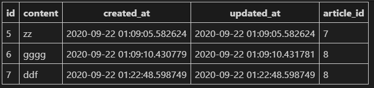

## 0 Django Many to One

> ### ForeignKey (1:N)
>
> ex) 게시글과 댓글들
>
> 외래키는 참조하는 테이블에서 1개의 키에 해당한다. 참초하는 입장의 변수(댓글)는 참조되는 (게시글) 측의 테이블 키를 가리킨다.
>
> 외래 키를 사용해 부모 테이블의 유일한 값을 참조한다. 참조하는 값은 유일해야 한다.
>
> ### 생성
>
> `    article = models.ForeignKey(Article, on_delete=models.CASCADE)`
>
> `models.py`에서 model 작성을 할 때 위와 같은 코드를 추가한다. 외래 키로 Article을 받으며, django에서는 자동으로 id를 참조하는 유일 값으로 한다. 여기서 `on_delete`는 참조하는 부모 객체가 사라졌을 때 달려 있는 댓글들을 어떻게 처리할지 정의한다. 
>
> - `CASCADE` : **부모 객체(참조 된 객체)가 삭제 됐을 때 이를 참조하는 객체도 삭제**한다.
> - `PROTECT` : 참조가 되어 있는 경우 오류 발생.
> - `SET_NULL` : 부모객체가 삭제 됐을 때 모든 값을 NULL로 치환. (NOT NULL 조건시 불가능)
> - `SET_DEFAULT` : 모든 값이 DEFAULT 값으로 치환 (DEFAULT 설정 있어야함. DB에서는 보통 default 없으면 null로 잡기도 함. 장고는 아님.)
> - `SET()` : 특정 함수 호출.
> - `DO_NOTHING` : 아무것도 하지 않음. 다만, 데이터베이스 필드에 대한 SQL `ON DELETE` 제한 조건을 설정해야 한다.
> - `RESTRICT`(new in 3.1) : RestrictedError를 발생시켜 참조 된 객체의 삭제를 방지
>
> ### 생성된 Table
>
> 
>
> 참조하는 외래 키는 해당 이름에 `_id`를 더해 열 이름을 만든다. 
>
> 즉 `article_id : 7` 글에  `id : 5` 댓글이 있다는 것
>
> 
>
> **1 : N 관계 manager**
>
> - **Article(1)** : **Comment(N)** : `comment_set`
>   - `article.comment` 형태로는 가져올 수 없다. 
>   - 게시글에 몇 개의 댓글이 있는지 Django ORM이 보장할 수 없기 때문 (본질적으로는 애초에 Article 클래스에 Comment 와의 어떠한 관계도 연결하지 않음)
>   - article 는 comment 가 있을 수도 있고, 없을 수도 있기 때문.
> - **Comment(N)** : **Article(1)** : `article`
>   - 그에 반해 댓글의 경우 `comment.article` 식의 접근이 가능한 이유는 어떠한 댓글이든 반드시 자신이 참조하고 있는 게시글이 있으므로 이와 같이 접근할 수 있다.
>
> 
>
> 부모 테이블에서 참조하는 측 (댓글)을 확인하는 방법
>
> - 부모 테이블에서 역으로 참조할 때(the relation from the related object back to this one.) `모델이름_set` 이라는 형식으로 참조한다. (**역참조**)
>
> - related_name 값은 django 가 기본적으로 만들어 주는 `_set` 명령어를 임의로 변경할 수 있다.
>
>   ```python
>   # articles/models.py
>   
>   class Comment(models.Model):
>       article = models.ForeignKey(Article, on_delete=models.CASCADE, related_name='comments')
>     ...
>   ```
>
> - 위와 같이 변경하면 `article.comment_set` 은 더이상 사용할 수 없고 `article.comments` 로 대체된다.
>
> - 1:N 관계에서는 거의 사용하지 않지만 M:N 관계에서는 반드시 사용해야 할 경우가 발생한다.


