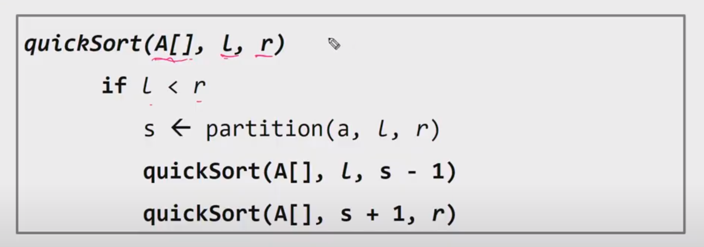
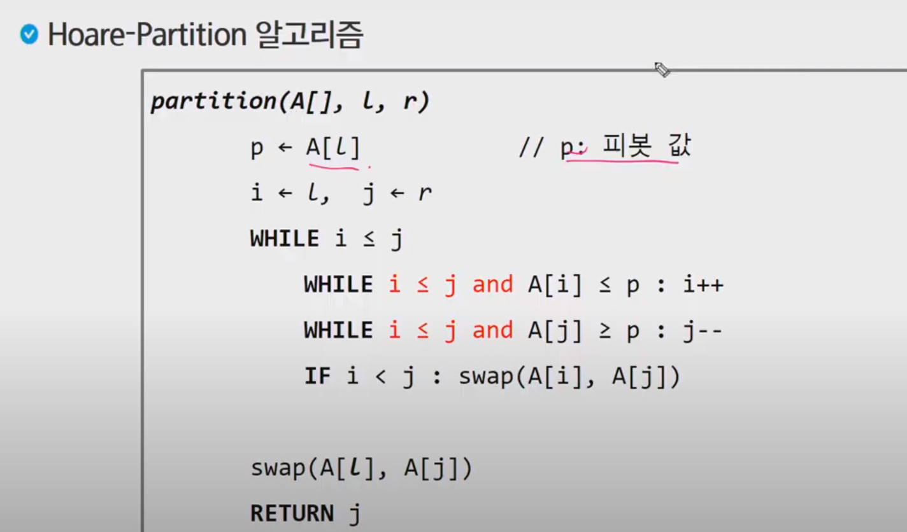
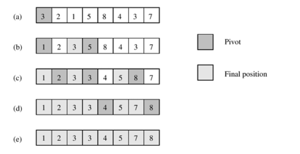

## 1. quicksort





1. 3을 기준으로, 3보다 큰 값 5를 i가 가리킨다. 3보다 작은값 1을 j가 가리킨다. i와 j가 교차하므로, j와 pivot 을 swap한다
2.  3보다 왼쪽과 오른쪽을 quick sort한다. (1 2) , (5 8 4 3 7)
   1. 1을 기준으로 보다 큰 값 2를 i가 가리키고, 1을 j가 가리킨다. i와 j가 교차하므로, j와 pivot swap (자기자신) 
   2. 5를 기준으로 5보다 큰 값 8을 i가 가리키고, 5보다 작은 3을 j가 가리킨다. 둘을 swap한다 (5 3 4 8 7)
   3. i는 8을 가리키고, j는 4를 가리킨다.  i와 j가 교차하므로 j와 pivot swap (4 3 5 8 7)
3.  5보다 왼쪽과 오른쪽을 quick sort한다. (4 3) , (8 7)
4. 완료

```python
def quick_sort(nums,l,r):
    #가장 왼쪽 값을 기준으로 삼는다.
    pivot = nums[l]
    i = l
    j = r
	# i와 j가 교차하지 않을 때 까지 진행
    while i<=j:
        # pivot 보다 큰 값이 나올때까지 i를 증가시킨다.
        while i <= j and nums[i] <= pivot: i+=1
        # pivot 보다 작은 값이 나올때까지 j를 감소시킨다.
        while i <= j and nums[j] >= pivot: j-=1
        # 만약 i 와 j가 교차하지 않는다면 SWAP 
        if i < j: nums[i],nums[j] = nums[j],nums[i]
    # i와 j가 교차했을 때, i와 j를 바꾸는 것이 아닌, pivot index와 j를 바꿔준다.
    # pivot index를 기준으로 
    # 왼쪽에는 pivot보다 작은 값, 
    # 오른쪽에는 pivot보다 큰 값이 존재하게 된다.
    nums[l],nums[j] = nums[j],nums[l]

    if l < j-1:quick_sort(num,l,j-1)
    if j+1 < r:quick_sort(num,j+1,r)

nums = [[11,45,23,81,28,34],[11,45,22,81,23,34,99,22,17,8],[1,1,1,1,1,0,0,0,0,0]]
for num in nums:
    print(num)
    quick_sort(num,0,len(num)-1)
    print(num)
```


## 2. mergesort

`mergesort` 함수에서는 리스트의 길이가 1일 때는 자기 자신을 반환한다.

리스트 길이가 1인 자기 자신을 반환하면, left와 right는 [element1] , [element2] 이렇게 된다.

`merge` 함수에서는 이 left 와 right 리스트를 가지고 크기 비교를 하여 새로운 리스트를 반환한다.

그러면 길이가 2 인 리스트가 되고, 이는  리스트 3과 리스트4를 정렬한 것이다. 마찬가지로 리스트2는 길이가 1인 리스트5와 리스트 6을 `merge`함수의 요소로 넣어 반환된 값이다. 마지막으로 리스트1과 리스트2를 `merge` 함수의 요소로 넣어 정렬하면 오름차순으로 정렬된 result를 얻는다.

​					result(0)

left(1)					  right(2) 

left(3) right(4)		left(5) 	right(6)

```python
def mergeSort(l):
    if len(l) == 1:return l
    mid = len(l)//2
    left = mergeSort(l[0:mid])
    right = mergeSort(l[mid:])
    return merge(left,right)

def merge(left,right):
    global cnt
    if left[-1] > right[-1]:
        cnt += 1
    tmp = []
    i=j=0
    while i < len(left) and j < len(right):

        if left[i] < right[j]:
            tmp.append(left[i])
            i += 1
            continue

        if left[i] >= right[j]:
            tmp.append(right[j])
            j += 1
            continue

    while i < len(left):
        tmp.append(left[i])
        i += 1

    while j < len(right):
        tmp.append(right[j])
        j += 1

    return tmp


for t in range(1,int(input())+1):
    N = int(input())
    L = list(map(int,input().split()))
    cnt = 0
    L=mergeSort(L)
    print("#{} {} {}".format(t,L[N//2],cnt))

```

