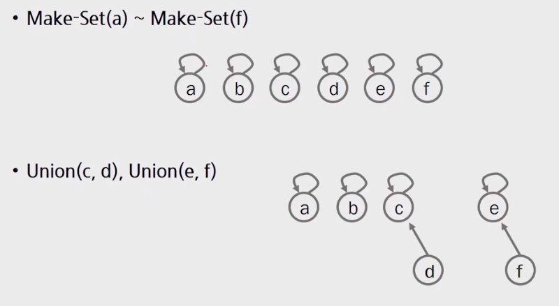
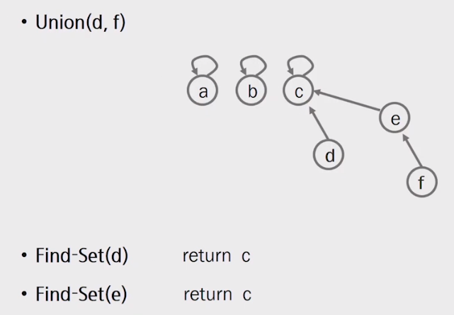
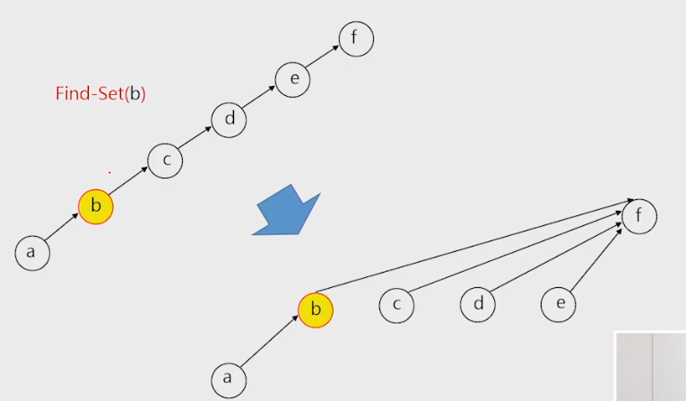
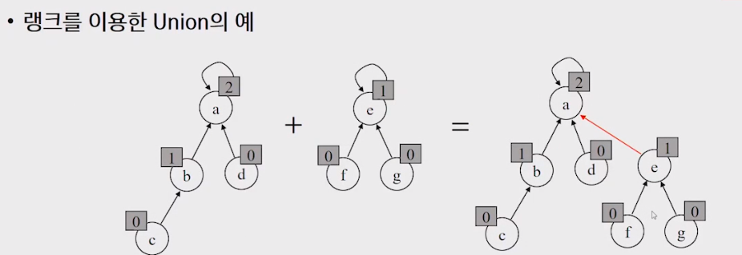
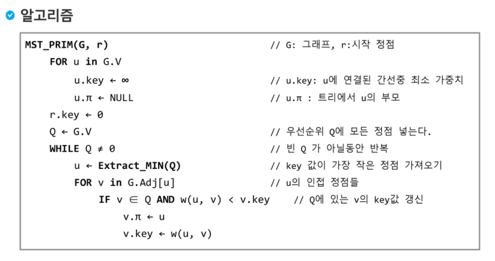
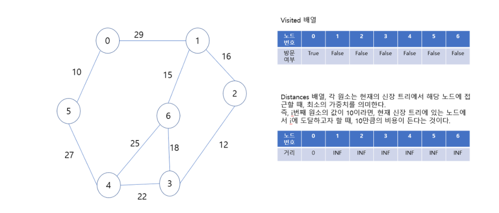
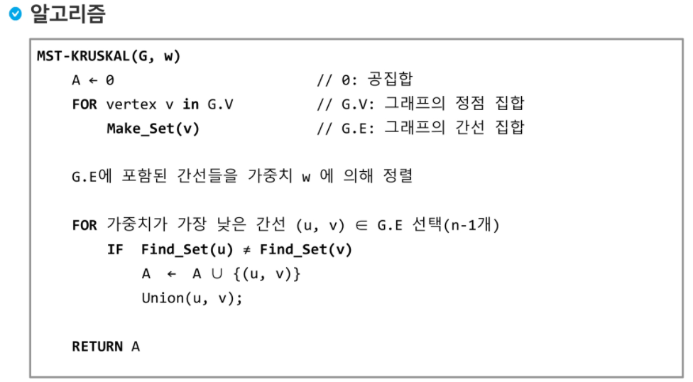
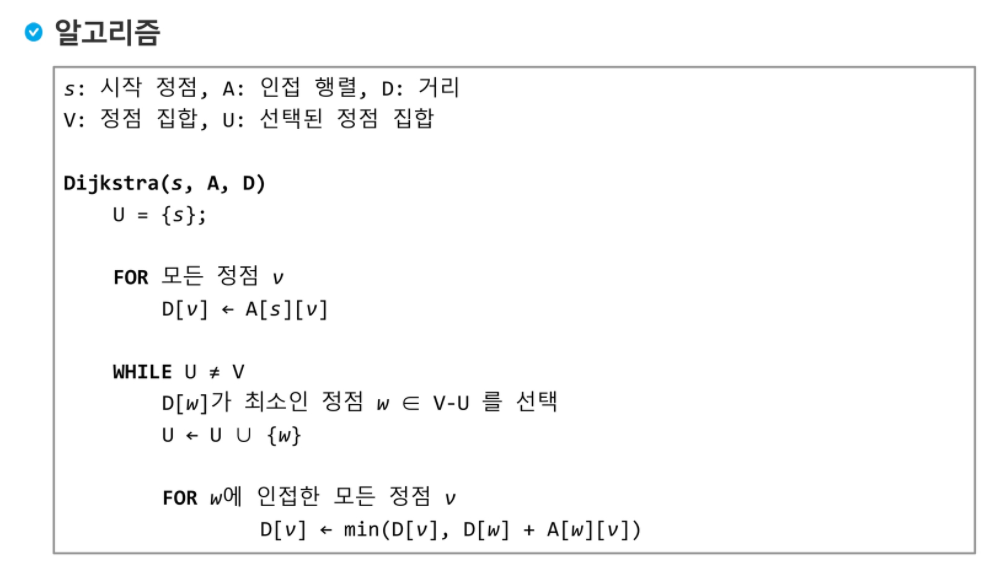

## 1. 서로소 집합

서로소 또는 상호배타 집합들은 서로 중복 포함된 원소가 없는 집합들이다. 다시 말해 교집합이 없다.

집합에 속한 하나의 특정 멤버를 통해 각 집합들을 구분한다. 이를 대표자라고 한다.

#### 상호배타 집합 연산

>  make set, find set, union
>
> make-set(x) : x를 대표 원소로 하는 집합을 만들어라.
>
> make-set(y) : y를 대표 원소로 하는 집합을 만들어라.
>
> union(x,y) : x가 대표원소인 집합과 y가 대표원소인 집합을 합쳐 x가 대표원소인 집합으로 만들어라.
>
> find-set(y) : y의 대표원소를 알려줘
>
> 

#### 상호배타 집합 표현

>  하나의 집합을 하나의 트리로 표현한다.
>
> 자식 노드가 부모 노드를 가리키며 루트 노드가 대표자가 된다

```python
def makeSet(x):
    p[x] = x


def findSet(x):
    while p[x] != x:
        x = p[x]
    return x


def unionSet(x,y):
    p[findSet(y)] = findSet(x)

```

#### 연산의 효율성을 높이는 방법

path compression

find-set을 행하는 과정에서 만나는 모든 노드들이 직접 root를 가리키도록 포인터를 바꿔준다. 



rank를 이용한 union

각 노드는 자신을 루트로 하는 subtree의 높이를 랭크(rank)라는 이름으로 저장한다. 두 집합을 합칠 때 rank가 낮은 집합을 rank가 높은 집합에 붙인다.




## 2. Prim Algorithm

#### 신장 트리 

- n개의 정점으로 이루어진 무향 그래프에서 n개의 정점과 n-1개의 간선으로 이루어진 트리

#### 최소신장트리 (Minimum Spanning Tree)

- 무향 가중치 그래프에서 신장 트리를 구성하는 간선들의 가중치의 합이 최소인 신장 트리

#### PRIM 

- 하나의 정점에서 연결된 간선들 중에 하나씩 선택하면서 MST를 만들어 가는 방식

1.  임의 정점을 하나 선택
2.  선택한 정점과 인접하는 정점들 중의 최소 비용의 간선이 존재하는 정점 선택
3.  모든 정점 선택할 때까지 반복



#### 효율성이 좋지 않은 prim 알고리즘

```python
# [inf, 29, inf, inf, inf, 10, inf]
# [29, inf, 16, inf, inf, inf, 15]
# [inf, 16, inf, 12, inf, inf, inf]
# [inf, inf, 12, inf, 22, inf, 18]
# [inf, inf, inf, 22, inf, 27, 25]
# [10, inf, inf, inf, 27, inf, inf]
# [inf, 15, inf, 18, 25, inf, inf]
weight = 0 #출력할 최소 가중치
while len(visited) != N: #방문한 노드 N개라면 반복문 중단
    MIN = math.inf
    for u in visited: #방문한 노드들의 인접 노드를 모두 불러온다
        for v in range(N): 
            if v not in visited: #방문하지 않은 노드들 중
                if MIN >= edges[u][v]: #최소 가중치인지 확인
                    MIN = edges[u][v]
                    tmp = v
    visited.append(tmp) #방문 노드에 최소 가중치를 가진 노드를 추가
    weight += MIN
print(weight)
```

#### 효율성을 높여보자 (과연?)




[사진출처](https://sexy-developer.tistory.com/58)

```python
# [inf, 29, inf, inf, inf, 10, inf]
# [29, inf, 16, inf, inf, inf, 15]
# [inf, 16, inf, 12, inf, inf, inf]
# [inf, inf, 12, inf, 22, inf, 18]
# [inf, inf, inf, 22, inf, 27, 25]
# [10, inf, inf, inf, 27, inf, inf]
# [inf, 15, inf, 18, 25, inf, inf]

def get_min_wegith_node():
    MIN = math.inf
    for i in range(N):
        if visited[i] == False:
            if MIN >= weights[i]:
                MIN = weights[i]
                min_idx = i
    return min_idx


def prim():
    res = 0
    while sum(visited) != N:
        for u in range(N):
            if visited[u] == True:  
                for v in range(N):
                    if weights[v] > edges[u][v]:
                        weights[v] = edges[u][v]
        idx = get_min_wegith_node()
        res += weights[idx]
        visited[idx] = True
    return res

visited = [False] * N
weights = [math.inf] * N
visited[0] = True
prim()
```


## 3. Kruskal Algorithm

#### KRUSKAL

- 간선을 하나씩 선택해서 MST를 찾는 알고리즘

1. 최초, 모든 간선을 가중치에 따라 오름차순으로 정렬
2. 가중치가 가장 낮은 간선부터 선택하면서 트리를 증가
   - 사이클이 존재하면 다음으로 가중치가 낮은 간선 선택
3. n-1개의 간선이 선택될 때까지 반복



```python
def makeSet(x):
    p[x] = x


def findSet(x):
    Q = []
    while p[x] != x:
        Q.append(x)
        x = p[x]
    for y in Q:
        p[y] = x
    return x


def unionSet(x,y):
    p[findSet(y)] = findSet(x)

N, M = map(int,input().split())
p = [0]*N
[makeSet(x) for x in range(N)]
edges = [list(map(int,input().split())) for _ in range(M)]
edges.sort(key=lambda x: x[-1])
cnt = res = 0
while cnt < N:
    for x,y,weight in edges:
        if findSet(x) != findSet(y):
            unionSet(x,y)
            res += weight
            break
    cnt+=1
print(res)
```


## 4. Dijkstra Algorithm

#### Dijkstra

- 시작 정점에서 거리가 최소인 정점을 선택해 나가면서 최단 경로를 구하는 방식
- 시작 정점 s 에서 끝정점 t 까지의 최단 경로에 정점 x가 존재, 이때 최단 경로는 s에서 x까지의 최단 경로와 x에서 t까지의 최단 경로로 구성된다.



```python
def get_min(U,D):
    MIN = math.inf
    for i in range(N):
        if i not in U:
            if D[i] <= MIN:
                MIN = D[i]
                idx = i
    return idx


def dijkstra(s,edges,D):
    U = [s]
    for i in range(N):
        D[i] = edges[s][i]
    while len(U) != N:
        w = get_min(U,D)
        U.append(w)
        for j in range(N):
            D[j] = min(D[j],D[w] + edges[w][j])


N, M = map(int,input().split())
edges = [[math.inf] * N for _ in range(N)]
for _ in range(M):
    u,v,weight = map(int,input().split())
    edges[u][v] = weight
D = [math.inf] * N
dijkstra(0,edges,D)
print(D)
```

