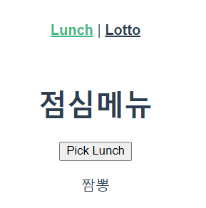
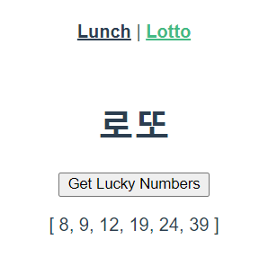
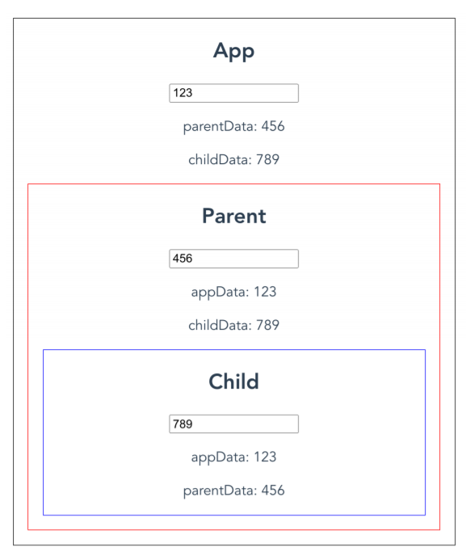

## Node.js

> 
>
> Node.js®는 [Chrome V8 JavaScript 엔진](https://v8.dev/)으로 빌드된 JavaScript 런타임입니다. Node.js의 패키지 생태계 `npm`은 세계에서 가장 큰 오픈소스 라이브러리 생태계이기도 하다.
>
> JavaScript는 브라우저 조작을 위한 언어였다. 즉 예전에는 JavaScript Runtime이 브라우저 밖에는 존재하지 않았다. 이러한 한계를 극복하기 위해 Node.js의 탄생
>
> #### Webpack & Babel
>
> - Webpack
>
>   모듈간의 의존성 때문에 문제가 발생, 의존성이 있는 코드 사이의 순서를 보장하기 어렵기 떄문에.... 이를 해결하기 위해서 모듈을 하나의 묶음으로 변환 
>
> - Babel
>
>   오래된 브라우저를 위해 Js 문법을 변환하기 위해 존재하는 도구 ( 컴파일러 )


## Vue-Cli

> Vue 프로젝트를 쉽게 개발할 수 있도록 도와주는 .. like Django
>
> Vue-Cli는 내부적으로 Webpack을 활용 자동으로 최적화해준다.
>
> 몇가지 명령어들
>
> - `npm install -g @vue/cli` : vue-cli 설치
> - `vue create <프로젝트>` : 프로젝트 만들기
> - `npm install` : 필요한 패키지 설치 (like `pip install -r requirements.txt` in Django)
> - `vue add router` : Vue에서 화면 이동을 쉽게 구현해주는 플러그인 (like `urls.py` in Django)


## Lotto & Lunch (using router)

>
>
>랜덤으로 점심메뉴, 로또 숫자를 출력하는 것을 구현
>
>### App.vue
>
>```html
><template>
>  <div id="app">
>    <div id="nav">
>      <router-link to="/lunch">Lunch</router-link> |
>      <router-link to="/lotto">Lotto</router-link>
>    </div>
>    <router-view/>
>  </div>
></template>
>```
>
>router - link 는 마치 `a` 태그와 같이 행동하지만 다르다 , 새로고침도 없이 데이터를 불러옴 
>
>`index.js`의 routes에서 맞는 path를 찾아 compotent를 불러온다.
>
>### index.js
>
>```javascript
>import Lunch from '../views/Lunch.vue'
>import Lotto from '../views/Lotto.vue'
>
>const routes = [
>  {
>    path: '/lotto',
>    name: 'Lotto',
>    component: Lotto
>  },
>  {
>    path: '/lunch',
>    name: 'Lunch',
>    component: Lunch
>  }
>]
>```
>
>### Lotto.vue
>
>```html
><template>
>  <div>
>    <h1>로또</h1>
>    <button @click="getNumbers">Get Lucky Numbers</button>
>    <p>{{luckyNumber}}</p>
>  </div>
></template>
>
><script>
>import _ from 'lodash'
>export default {
>  name:'Lotto',
>  data : function () {
>    return {
>      luckyNumber : [],
>    }
>  },
>  methods : {
>    getNumbers : function () {
>      const numbers = _.range(1,46)
>      this.luckyNumber = _.sortBy(_.sampleSize(numbers,6))
>    }
>  }
>}
></script>
>```
>
>### Lunch.vue
>
>```html
><template>
>  <div>
>    <h1>점심메뉴</h1>
>    <button @click="getLunch">Pick Lunch</button>
>    <p>{{menu}}</p>
>  </div>
></template>
>
><script>
>import _ from 'lodash'
>
>export default {
>  name : "Lunch",
>  data : function () {
>    return {
>      menus : ['국밥','떡볶이','파스타','피자','짬뽕'],
>      menu : ''
>    }
>  },
>  methods : {
>    getLunch : function () {
>      const randomIndex = _.random(this.menus.length-1)
>      this.menu = this.menus[randomIndex]      
>    }
>  }
>}
></script>
>```


## Emit event, Pass Pros

> Emit event : 자식 데이터 변경시 부모에게 알려 해당 데이터를 반환
>
> Pass Pros : 부모 - > 자식으로의 단방향의 데이터 흐름 ( 과거에는 양방향 가능했으나, 거대한 프로젝트에서  해당 데이터가 어떤 곳에 종속되어 있는지 찾기 힘들어 유지 보수가 어려움)
>
> 
>
> 최상위 노드 app 두번째 노드 parent, 마지막 노드 child 간의 데이터 전달을 구현
>
> 자식 -> 부모로 데이터를 전달할 때 `this.$emit('부모에서 사용할 리스너', 전달데이터)` 이렇게 사용
>
> 
>
> ### App.vue
>
> ```html
> <template>
>   <div id="app">
>     <h1>App</h1>
>     <input type="text" v-model="appData">
>     <p>parentData : {{parentData}}</p>
>     <p>childData : {{childData}}</p>
>     <Parent 
>     :appData="appData"
>     @child-input="childInput"
>     @parent-input="parentInput"
>     />
>   </div>
> </template>
> 
> <script>
> import Parent from './components/Parent.vue'
> 
> export default {
>   name: 'App',
>   components: {
>     Parent    
>   },
>   data : function () {
>     return {
>       appData : '',
>       parentData : '',
>       childData : '',
>     }
>   },
>   methods : {
>     parentInput : function(parent) {
>       this.parentData = parent
>     },
>     childInput : function(child) {
>       this.childData = child
>     }
>   }
> }
> </script>
> 
> <style>
> #app {
>   font-family: Avenir, Helvetica, Arial, sans-serif;
>   -webkit-font-smoothing: antialiased;
>   -moz-osx-font-smoothing: grayscale;
>   text-align: center;
>   color: #2c3e50;
>   margin: 10px;
>   border: solid black;
> }
> </style>
> ```
>
> ### Parent.vue
>
> ```html
> <template>
>   <div id="parent">
>     <h1>Parent</h1>
>     <input type="text" v-model="parentData" @change="parentInput">
>     <p>appData : {{appData}}</p>
>     <p>childData : {{childData}}</p>
>     <Child 
>     :parentData="parentData"
>     :appData="appData"
>     @child-input="childInput" />
>   </div>
> </template>
> 
> <script>
> import Child from './Child.vue'
> 
> export default {
>   name : 'Parent',
>   components : {
>     Child
>   },
>   props : {
>     appData : String,
>   },
>   data : function () {
>     return {
>       parentData : '',
>       childData : '',
>     }
>   },
>   methods : {
>     childInput : function (child) {
>       this.childData = child
>       this.$emit('child-input',this.childData)
>     },
>     parentInput : function () {
>       this.$emit('parent-input',this.parentData)
>     }
>   }
> }
> </script>
> 
> <style>
> #parent {
>   font-family: Avenir, Helvetica, Arial, sans-serif;
>   -webkit-font-smoothing: antialiased;
>   -moz-osx-font-smoothing: grayscale;
>   text-align: center;
>   color: #2c3e50;
>   margin: 10px;
>   border: solid blueviolet;
> }
> </style>
> ```
>
> ### Child.vue
>
> ```html
> <template>
>   <div id="child">
>     <h1>Child</h1>
>     <input type="text" v-model="childData" @change="childInput">
>     <p>appData : {{appData}}</p>
>     <p>parentData : {{parentData}}</p>
>   </div>
> </template>
> 
> <script>
> 
> export default {
>   name : 'Child',
>   props : {
>     appData : String,
>     parentData : String,
>   },
>   data : function () {
>     return {
>       childData : '',
>     }
>   },
>   methods : {
>     childInput : function () {
>       this.$emit('child-input',this.childData)
>     }
>   }
> }
> </script>
> 
> <style>
> #child {
>   font-family: Avenir, Helvetica, Arial, sans-serif;
>   -webkit-font-smoothing: antialiased;
>   -moz-osx-font-smoothing: grayscale;
>   text-align: center;
>   color: #2c3e50;
>   margin: 10px;
>   border: solid red;
> }
> </style>
> ```
>
> 

