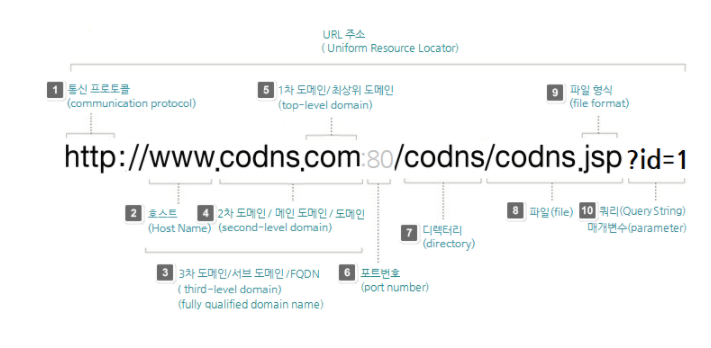

## 1. SOP (Same Origin Policy)

동일 출처 정책(same-origin policy)은 어떤 출처에서 불러온 문서나 스크립트가 다른 출처에서 가져온 리소스와 상호작용하는 것을 제한하는 중요한 보안 방식입니다. 동일 출처 정책은 잠재적으로 해로울 수 있는 문서를 분리해, 공격받을 수 있는 경로를 줄입니다.

즉, **동일 출처 정책은 웹 브라우저 보안을 위해 프로토콜, 호스트, 포트가 동일한 서버로만 ajax 요청을 주고 받을 수 있도록 한 정책**이다. 

#### CORS (Cross Origin Resource Sharing)

Cross-Origin Resource Sharing(CORS) 은 추가 HTTP 헤더를 사용하여 브라우저가 한 출처에서 실행중인 웹 애플리케이션에 선택된 액세스 권한을 부여하도록하는 메커니즘입니다. 다른 출처의 자원. **웹 응용 프로그램은 자체와 다른 출처 (도메인, 프로토콜 또는 포트)를 가진 리소스를 요청할 때 cross-origin HTTP 요청을 실행**합니다.

즉, *Same-Origin Policy의 문제점을 해결하기 위한 정책인 만큼* **CORS란 cross-Origin 즉, 출처가 다른 도메인에서의 AJAX요청이라도 서버 단에서 데이터 접근 권한을 허용하는 정책**이다.

## 2. JWT (JSON Web Token) [출처](https://velog.io/@geuni1013/JWT-%EC%A0%95%EB%A6%AC-%EA%B0%9C%EC%9D%B8%EC%A0%95%EB%A6%AC)

JWT는 속성 정보를 JSON 데이터 구조로 표현한 토큰으로 RFC7519 표준이다.

JWT는 서버와 클라이언트 간 정보를 주고 받을 때 HTTP Request Header에 JSON 토큰을 넣은 후 서버는 별도의 인증 과정없이 헤더에 포함되어 있는 JWT 정보를 통해 인증한다.

이때 사용되는 JSON 데이터는 URL-Safe 하도록 URL에 포함할 수 있는 문자만으로 만든다.

JWT는 HWAC 알고리즘을 사용하여 비밀키 또는 RSA를 이용한 (Public Key/Private Key)쌍 으로 서명할 수 있다.

#### JWT 토큰 구성

header.payload.signature

- header: 토큰의 타입과 해시 암호화 알고리즘으로 구성되어 있다.
- payload: 토큰에 담을 클레임(claim) 정보를 포함하고 있다. name-value 한 쌍으로 이루어져있고, 여러개의 클레임 들을 넣을 수 있다.
- signature: secret key를 포함하여 암호화되어 있다.

#### JWT를 통한 Client-Server간 인증 과정

1. Client에서 로그인을 하면
2. Server에서 로그인 확인 후 secret key를 통해 Access token을 발급하여 클라이언트에 JWT를 반환해준다.
3. 그 후 JWT를 클라이언트에서 보관하다 서버에 요청을 할 때 마다 JWT를 같이 Request Header에 전달해주면
4. 서버에서 클라이언트가 준 JWT의 서명을 체크하고 JWT에서 사용자 정보를 확인한 뒤
5. 올바를 경우 클라이언트의 Request에 맞는 Response를 반환하고, 맞지 않을 경우 그에 따른 처리를 한다.

#### JWT 장점

- 사용자 인증에 필요한 모든 정보는 토큰 자체에 포함하기 때문에 별도의 인증 저장소가 필요없다.

## 3. 쿠키와 세션 [출처](https://doooyeon.github.io/2018/09/10/cookie-and-session.html)

### 쿠키(Cookie) 란?

- 개념
  - 클라이언트 로컬에 저장되는 키와 값이 들어있는 파일이다.
  - 이름, 값, 유효 시간, 경로 등을 포함하고 있다.
  - 클라이언트의 상태 정보를 브라우저에 저장하여 참조한다.
- 구성 요소
  - 쿠키의 이름(name)
  - 쿠키의 값(value)
  - 쿠키의 만료시간(Expires)
  - 쿠키를 전송할 도메인 이름(Domain)
  - 쿠키를 전송할 경로(Path)
  - 보안 연결 여부(Secure)
  - HttpOnly 여부(HttpOnly)
- 동작 방식
  1. 웹브라우저가 서버에 요청
  2. 상태를 유지하고 싶은 값을 쿠키(cookie)로 생성
  3. 서버가 응답할 때 HTTP 헤더(Set-Cookie)에 쿠키를 포함해서 전송
  4. 전달받은 쿠키는 웹브라우저에서 관리하고 있다가, 다음 요청 때 쿠키를 HTTP 헤더에 넣어서 전송
  5. 서버에서는 쿠키 정보를 읽어 이전 상태 정보를 확인한 후 응답

### 세션(Session) 이란?

- 개념
  - 일정 시간 동안 같은 브라우저로부터 들어오는 요청을 하나의 상태로 보고 그 상태를 유지하는 기술이다.
  - 즉, 웹 브라우저를 통해 서버에 접속한 이후부터 브라우저를 종료할 때까지 유지되는 상태이다.
- 동작 방식
  1. 웹브라우저가 서버에 요청
  2. 서버가 해당 웹브라우저(클라이언트)에 유일한 ID(Session ID)를 부여함
  3. 서버가 응답할 때 HTTP 헤더(Set-Cookie)에 Session ID를 포함해서 전송,
  4. 웹브라우저는 이후 웹브라우저를 닫기까지 다음 요청 때 부여된 Session ID가 담겨있는 쿠키를 HTTP 헤더에 넣어서 전송
  5. 서버는 세션 ID를 확인하고, 해당 세션에 관련된 정보를 확인한 후 응답

세션도 쿠키를 사용하여 값을 주고받으며 클라이언트의 상태 정보를 유지한다.
즉, 상태 정보를 유지하는 수단은 **쿠키** 이다.

### 쿠키와 세션의 차이점

- 저장 위치
  - 쿠키 : 클라이언트
  - 세션 : 서버
- 보안
  - 쿠키 : 클라이언트에 저장되므로 보안에 취약하다.
  - 세션 : 쿠키를 이용해 Session ID만 저장하고 이 값으로 구분해서 서버에서 처리하므로 비교적 보안성이 좋다.
- 라이프사이클
  - 쿠키 : 만료시간에 따라 브라우저를 종료해도 계속해서 남아 있을 수 있다.
  - 세션 : 만료시간을 정할 수 있지만 브라우저가 종료되면 만료시간에 상관없이 삭제된다.
- 속도
  - 쿠키 : 클라이언트에 저장되어서 서버에 요청 시 빠르다.
  - 세션 : 실제 저장된 정보가 서버에 있으므로 서버의 처리가 필요해 쿠키보다 느리다.

>[URL이란 무엇인가](http://www.codns.com/b/B05-195)
>
>
>
>**URL 주소** - URL은 Uniform Resource Locator의 약자로 URL은 네트워크 상에서 자원이 어디 있는지를 알려주기 위한 규약으로 흔히 웹 주소 또는 인터넷 주소라고도 불리며 URI (uniform resource identifier)의 한 유형으로 리소스의 위치와 액세스에 사용되는 프로토콜을 나타냅니다. 
>
>| 번호 | 구분                                  | 내용                                                         |
>| ---- | ------------------------------------- | ------------------------------------------------------------ |
>| 1    | 통신 프로토콜 (communication protocol | 네트워크 상의 서버로 부터 웹 문서 정보(html)와 이미지 등의 리소스를 받아올 통신 방식을 미리 정해 놓은 것으로 HTTP, HTTPS, FTP, FILE, MAILTO 등이 가장 잘 알려져 있습니다. |
>| 2    | 호스트 (Host Name)                    | 호스트 명은 네트워크에 연결된 장치 또는 서버들에 부여되는 고유한 이름으로 호스트 명은 IP 주소나 MAC 주소와 같은 기계적인 이름을 대신하여 일반인이 쉽게 읽고 이해할 수 있는 이름으로 만들어집니다, |
>| 3    | 3차 도메인 (third-level domain)       | 리소스가 네트워크(인터넷)상에 위치하는 물리적 위치로 Namespace 계층 상에서 최종 호스트 명을 포함하는 도메인 명을 뜻하는 FQDN(Fully Qualified Domain Name)이라고도 하며, 2차 도메인에 WWW와 같이 호스트 명를 부가한 3차 도메인 또는 서브 도메인 이라고도 합니다. |
>| 4    | 2차 도메인 (second-level domain)      | 일반적으로 도메인 둥록/구매처에서 등록하여 사용하는 도메인을 가리키며 서브 도메인에 대응하여 메인 도메인(또는 zone apex/root domain/naked domain/bare domain)으로 불리기도 하며,3차 도메인과 혼용하여 부르기도 합니다. |
>| 5    | 최상위 도메인 (top-level domain)      | 인터넷에서 도메인 네임의 가장 마지막 부분으로 특정한 조직 계열에 따라 사용되는 도메인입니다. com, net, org, edu, gov, mil등의 일반 최상위 도메인(gTLD)와 co.kr, kr과 같은 국가 코드 최상위 도메인(ccTLD)이 있습니다. |
>| 6    | 포트 번호 (port number)               | 포트 번호는 네트워크 또는 인터넷을 사용하여 통신하는 각 응용 프로그램 또는 프로세스의 논리 주소로 0에서 65,535번 까지 포트 번호를 사용하며 HTTP 80, HTTPS 443, FTP 21 등이 있습니다. 위의 URL 예제와 같이 HTTP가 기본 포트인 80번으로 설정된 경우, 80번은 생략될 수 있습니다. |
>| 7    | 디렉터리 (directory)                  | 해당 파일(또는 자원)이 서버의 어디에 있는지를 나타내는 경로로서 초기의 웹에서는 웹 서버상에서 물리적 파일 위치를 의미하였으나, 최근에는, 실제 물리적 경로를 나타내지 않고, 웹 서버에서 추상화하여 보여줍니다. |
>| 8    | 파일 (file)                           | 월드 와이드 웹 상에서 연결 할 실제 파일의 이름으로 HTML(또는 XHTML), CSS 문서, 자바스크립트, 이미지, 문서,동영상 등의 파일을 가리킵니다, |
>| 9    | 파일 형식 (file format)               | 일반적으로 사용하는 웹 프로그래밍 언어에 따라 달라지며 HTML, CGI, PHP, JSP, ASP 등이 사용됩니다. |
>| 10   | 쿼리 스트링 (Query String)            | 웹 서버에 제공하는 추가 파라미터로 이 파라미터들은 & 기호로 구분된 키/값으로 짝을 이룬 일련의 쿼리 리스트들로 이루어져 있습니다. |