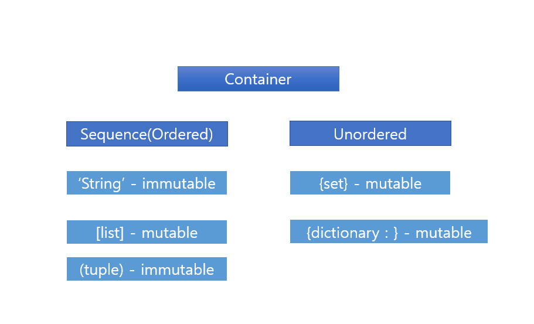

# 20.07.20 오늘 새로 배운점


## 1. 변수

> - `id()` 를 활용하여 해당 값의 메모리 주소를 확인할 수 있다.
> - 같은 값을 동시에 할당하거나, 다른 값을 동시에 할당하는 방법
>
> ```python
> x = y = 'hello'
> a, b = 10, 20
> ```
>
> - 파이썬에서는 두 변수의 할당 값을 바꿔주는 swap 기능이 있다.
>
> ```python
> a , b = b, a
> ```

## 2. 숫자 타입

> 
>
> ### 2.1 int (정수, integer)
>
> 파이썬에서 가장 큰 숫자를 활용하기 위해 `import sys`를 통해 모듈을 불러온다.
>
> 파이썬은 C 계열 프로그래밍 언어와 다르게 정수 자료형에서 오버플로우가 없다. arbitrary-precision arithmetic을 사용하기 때문이다.
>
> - 오버플로우
>
>   데이터 타입 별로 사용할 수 있는 메모리의 크기가 제한되어 있어서 이 범위를 넘어가는 연산을 하게 되면,  기대했던 값이 출력되지 않는 현상
>
> - arbitrary-precision arithmetic
>
>   사용 가능한 메모리 양이 정해져  있는 기존 방식과 달리 남아 있는 가용 메모리를 모두 수 표현에 쓸 수 있는 형태
>
> ### 2.2 float (부동소수점, 실수, floating point number)
>
> 실수를 컴퓨터가 표현하는 과정에서 오류가 발생한다, 이는 비트를 소수로 표현하는 과정에서 생기는 오류
>
> 오류를 해소하는 방법에 대하여 알아보면 다음과 같다.
>
> - `sys.float_info.epsilon` 
>
>   `epsilon` 은 부동소수점 연산에서 반올림을 함으로써 발생하는 오차 상환
>
> ```python
> import sys
> sys.float_info.epsilon
> a = 3.5-3.2
> b = 0.3
> print(a)
> print(b)
> print(abs (a-b) <= sys.float_info.epsilon)
> ```

​	실행결과

> ```python
> 0.2999999999999998
> 0.3
> True
> ```
>
> - `math.isclose()`
>
>   `math` 모듈을 통해서 부동소수를 처리할 수 있다.
>
> ```python
> import math
> a = 3.5 - 3.2
> b = 0.3
> math.isclose(a,b)
> ```

​	실행결과

> ```python
> True
> ```

## 3. 형변환

> ### 3.1 명시적 형변환
>
> - 사용자가 의도하지 않았지만, 파이썬에서 자동적으로 형변환 하는 경우
>
> ### 3.2 암시적 형변환
>
> - 사용자가 형변환 하는 경우

## 4. 논리연산자

> ### 4.1 and
>
> - a and b
>
>   a와 b 모두 True일 때 True 나머지는 False
>
> ### 4.2 or
>
> - a or b
>
>   a와 b 모두 False일 때 False 나머지는 True
>
> ### 4.3 단축평가
>
> - 첫 번째 값이 확실할 때, 두 번째 값을 고려하지 않는 평가
>
> - 조건문 뒷 부분을 확인하지 않아도 되기 때문에 계산 속도 향상
>
>   - and
>
>     첫 번째 항목이 False이면 무조건 False
>
>   - or
>
>     첫 번째 항목이 True이면 무조건 True
>
> ```python
> 'a' and 'b'
> '' and 'b'
> 'a' or 'b'
> '' or 'b'
> ```

​	실행결과

> ```python
> 'b'
> ''
> 'a'
> 'b'
> ```

## 5. 컨테이너 (Container)

> ### 5.1 시퀀스 형 컨테이너 (sequence)
>
> - 데이터가 순서대로 나열된 형식, sorted라는 뜻은 아니다.
>
>   순서를 가질 수 있으며, 특정 위치의 데이터를 가리킬 수 있다.
>
> - 종류로는 리스트(list), 튜플(tuple), 레인지(range), 문자형(string), 바이너리(binary)
>
> - 시퀀스에서 활요할 수 있는 연산자 / 함수
>
> |  operation   |          설명           |
> | :----------: | :---------------------: |
> |   x `in` s   |    containment test     |
> | x `not in` s |    containment test     |
> |  s1 `+` s2   |      concatenation      |
> |   s `*` n    | n번만큼 반복하여 더하기 |
> |    `s[i]`    |        indexing         |
> |   `s[i:j]`   |         slicing         |
> |  `s[i:j:k`]  |    k간격으로 slicing    |
> |    len(s)    |          길이           |
> |    min(s)    |         최솟값          |
> |    max(s)    |         최댓값          |
> |  s.count(x)  |        x의 개수         |
>
> ### 5.2 비 시퀀스형 컨테이너 (Non-sequence)
>
> - 순서가 없는 자료구조
> - 종류로는 셋(set), 딕셔너리(dictionary)


