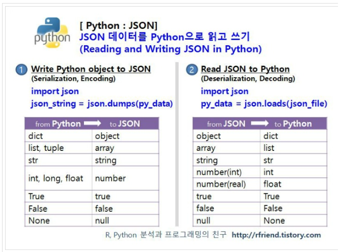

# READEM

> prjoect01을 진행하면서 새롭게 배운것들, 에러를 해결한 것들을 정리합니다.


## 새롭게 배운것

> - ### open()
>
>   filename : 내가 열고싶은 파일의 이름을 적는다.
>
>   mode : `r` 읽기모드, `w` 쓰기모드, 아무것도 적지 않으면 기본적으로 읽기모드로 적용된다.
>
>   encoding : 한글 때문에 파일이 정상적으로 dict로 변환이 안된 경우 `UTF8` 을 적용하여 해결했다.
>
>   ```python
>   open(filename, mode)
>   ```
>
> 
>
> - ### json이 뭐지?
>
>   JSON (JavaScript Object Notation) 은 효율적으로 데이터를 저장하고 교환(exchange data)하는데 사용하는 텍스트 데이터 포맷
>
>   
>
>   Json은 두 개의 구조로 이루어져 있다.
>
>   - 이름 / 값 쌍의 집합 : hash table, dictionary, object
>   - 정렬된 값의 리스트 : array, list, vector, sequence
>
>   
>
>   `dump()` 와 `load()`
>
>   dump()는 Python 객체를 Json 데이터로 쓰는 것
>
>   load()는 Json 데이터를 Python 객체로 읽는 것 
>
> 
>
> ​			[출처](https://rfriend.tistory.com/474)
>
> 
>
> - ### `if __name__ == '__main__':`
>
>   `__name__` 변수의 값이 '`__main__`'인지 확인하는 코드는 현재 스크립트 파일이 프로그램의 시작점이 맞는지 판단하는 작업
>
>   즉, 스크립트 파일이 메인 프로그램으로 사용될 때와 모듈로 사용될 때를 구분하기 위한 용도
>
>   
>
>   ```python
>   print('hello 모듈 시작')
>   print('hello.py __name__:', __name__)
>   print('hello 모듈 끝')
>   ```
>
>   ```python
>   import hello
>   print('main 모듈 시작')
>   print('main.py __name__:', __name__)
>   print('main 모듈 끝')
>   # 실행결과
>   # hello 모듈 시작
>   # hello.py __name__: hello
>   # hello 모듈 끝
>   # main 모듈 시작
>   # main.py __name__: __main__
>   # main 모듈 끝
>   ```
>
>   
>
>   파이썬에서 import로 모듈을 가져오면 해당 스크립트 파일이 한 번 실행된다. 이 때 `__name __`변수에는 모듈의 이름이 저장된다.
>
>   
>
>   **참고 |** **파이썬은 왜 프로그램의 시작점이 정해져 있지 않나요?**
>
>   파이썬이 처음에 개발 될 당시에는 리눅스/유닉스에서 사용하는 스크립트 언어 기반이었기 때문에 프로그램의 시작점이 따로 정해져 있지 않았습니다. 보통 리눅스/유닉스의 스크립트 파일은 파일 한 개로 이루어진 경우가 많은데, 이 스크립트 파일 자체가 하나의 프로그램이다 보니 시작점이 따로 필요하지 않습니다. 하지만 C 언어나 자바같은 언어는 처음 만들어질 때부터 소스 파일을 여러 개 사용했기 때문에 여러 소스 파일의 함수들 중에서도 시작 함수(main)를 따로 정해 놓았습니다.	[출처](https://dojang.io/mod/page/view.php?id=2448)
>
>   
>
> - ### `enumerate()`
>
>   카운트와 iterable을 iteration해서 얻어지는 값을 포함하여 튜플로 반환한다.
>
>   ```python
>   A = ['a','b','c','d']
>   print(list(enumerate(A)))
>   # 실행결과
>   # [(0, 'a'), (1, 'b'), (2, 'c'), (3, 'd')]
>   ```
>
>   for문에서 리스트 안의 요소와 그 요소의 인덱스를 동시에 추출하고 싶다면 다음과 같이 사용할 수 있다.
>
>   ```python
>   A = ['a','b','c','d']
>   for idx, element in enumerate(A):
>       print(idx,element)
>   #실행결과
>   # 0 a
>   # 1 b
>   # 2 c
>   # 3 d
>   ```
>
> 
>
> - ### Dictionary에서 key의 이름 변경하기
>
>   ```python
>   #1 새로운 이름의 key에 기존 key의 value를 할당하고 지운다.
>   dictionary[new_key] = dictionary[old_key]
>   del dictionary[old_key]
>   #2 새로운 이름의 key에 기존 key의 value를 할당하고 동시에 지운다.
>   dictionary[new_key] = dictionary.pop(old_key)
>   ```
>
>    
>
>   
>
> - ### 파일 읽기, 쓰기
>
>   `f.write()`
>
>   ```python
>   f = open('test.txt','w')
>   f.write('Hello, Python !\n')
>   f.close()
>   ```
>
>   위의 코드를 통해서 현재 디렉토리에 test.txt 파일이 생성된다.
>
>   
>
>   `with()` 
>
>   파일을 열면 항상 close 해야하지만, with문이 자동적으로 파일을 닫아 준다. with문을 사용하면 with 블록을 벗어나는 순간 열린 파일 객체 f가 자동으로 close되어 편리하다.
>
>   
>
>   `f.read()`
>
>   ```python
>   f = open('test.txt','r')
>   f.read()
>   ```
>
>   줄이 끝날 때까지 읽는 방법, 이 때 `not` 연산자는 자동 형변환을 가능하게 해준다. 따라서 비어있으면 `True` 반환하여 `break`를 실행한다.
>
>   ```python
>   f = open("test.txt", "r")
>   while True:
>       line = f.readline()
>       if not line:
>           break
>       print(line)
>   ```
>
>   
>
>   두 개를 비교해보고 이해해보자
>
>   ```python
>   import json
>    
>   jstring = json.dumps(data, ensure_ascii=False, indent=4)
>   f = open(filename, "w")
>   f.write(jstring)
>   f.close()
>   ```
>
>   vs
>
>   ```python 
>   with open('filename.json', 'w',encoding = 'utf-8') as f:
>       json.dump(data,f,ensure_ascii=False,indent =4)
>     
>   ```
>
>   `ensure_ascii=False` 유니코드가 아스키 문자로 변환되지 않게 한다.
>
>   `indent=4` 줘서 탭 문자로 들여쓰기를 함으로써 가독성을 향상시킨다.


