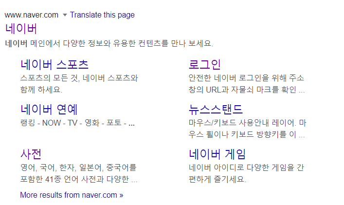
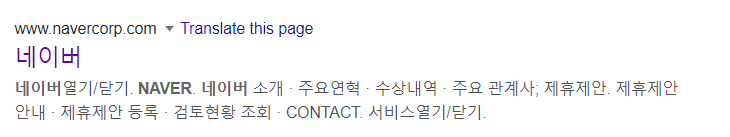
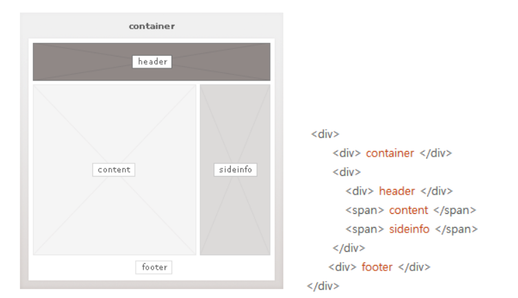
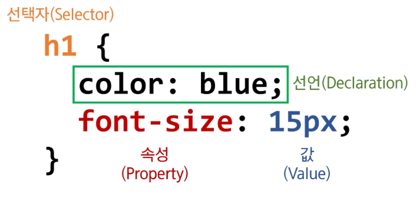
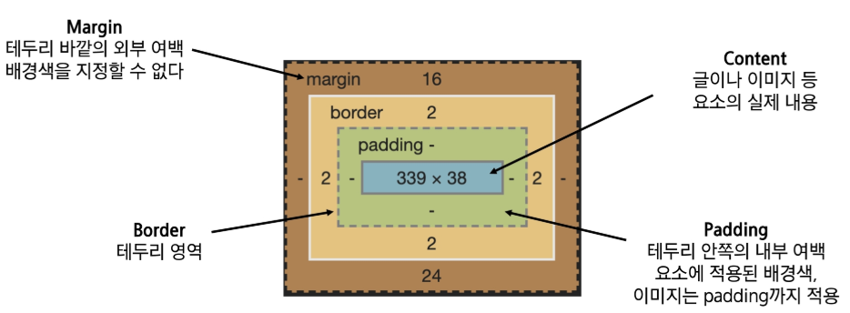

# 0810

## 1. HTML (Hyper Text Markup Language)

> Hyper Text : 선형적인 텍스트가 아닌 비 선형적으로 이루어진 텍스트 Hyper Link를 통해 텍스트를 이동한다
>
> Markup Language : 태그 등을 이용해 데이터의 구조를 명시하는 언어, 프로그래밍 언어와는 다르게 단순히 데이터를 표현하기만 한다
>
> 즉 웹 페이지 작성하기 위한 구조를 잡기 위한 언어, 웹 컨텐츠의 의미와 구조를 정의
>
> ```html
> <!DOCTYPE html>
> <html lang="en">
> <head>
>   <meta charset="UTF-8">
>   <meta name="viewport" content="width=device-width, initial-scale=1.0">
>   <title>Document</title>
> </head>
> <body>
>   
> </body>
> </html>
> ```
>
> ### `head` 
>
> head 요소는 문서 제목, 문자코드(인코딩) 같이 해당 문서 정보를 담고 있으며, 브라우저에 나타자지 않는다. CSS 선언 혹은 외부 로딩 파일 지정 등도 작성한다.
>
> ### `body`
>
> body 요소는 브라우저 화면에 나타나는 정보. 실제 내용에 해당한다.
>
> ### 요소와 속성
>
> HTML의 요소는 태그와 내용(contents)로 구성되어 있다.
>
> ```html
> <h1><!--여는태그-->
>     contents
> </h1><!--닫는태그-->
> <a href="https://google.com"></a> <!--속성명과 속성값-->
> ```
>
> 


## 2. 시멘틱 태그

> 장점
>
> 1. 읽기가 쉬워진다.(개발자)
>
> - 개발자가 의도한 요소의 의미가 명확히 드러난다.
> - 코드의 가독성을 높이고 유지보수를 쉽게 한다
>
> 2. 접근성이 좋아진다.
>
> - 검색엔진 또는 시력장애용 스크린리더로 더 나은 사용자 경험을 제공
> 
>   
> - 의미를 부여한다.
>
> 3. 텍스트 관련 요소
>
> - 같은 역할을 하는 태그가  굳이 2개 존재?! <strong>은 시멘틱과 유사 , 스크린 리더가 강조를 한다. <em> 이탤릭체로 강조를 한다.
>
> `div`와 `span`의 차이 


## 3. HTML 문서 구조화

> ### `form`
>
> 사용자의 입력이 들어온다. 서버에서 처리될 데이터를 제공하는 역할
>
> 기본 속성으로는 `action` `method` 가 있다.
>
> ### `input`
>
> 다양한 타입을 가지는 입력 데이터 필드 `<label>`은 서식 입력 요소의 캡션을 달아준다.


## 4. CSS(Cascading Style Sheets)

> 스타일, 레이아웃 등을 통해 HTML을 표시하는 방법을 지정하는 언어
>
> 
>
> ### 정의 방법
>
> 1. 인라인(inline)
>
>    ```html
>    <h1 style="color : blue; font-size : 100px;">
>        hello
>    </h1>
>    ```
>
> 2. 내부 참조(embedding) - <style> (head 태그 내에 지정)
>
>    ```html
>    <head>
>        <style>
>            h1 {
>                color : blue;
>                font-size : 100px;
>            }
>        </style>
>    </head>
>    ```
>
> 3. 외부 참조(link file) - 분리된 CSS 파일 (head 내 link를 통해 불러온다)
>
> 
>
> ### 선택자 (Selector)
>
> HTML 문서에서 특정한 요소를 선택하여 스타일링하기 위해서 반드시 선택자라는 개념이 필요하다
>
> - 기초 선택자
>   - 전체 선택자, 타입 선택자, 클래스 선택자 아이디 선택자, 속성 선택자
> - 고급 선택자
>   - 자식 선택자, 자손 선택자, 형제, 인접 형제 선택자
> - 의사 클래스
>   - 링크, 동적 의사 클래스, 구조적 의사 클래스
>   - 
>
> ### CSS 적용 우선순위 (cascading order)
>
> !important > 인라인 > id 선택자 > class 선택자 > 요소 선택자 > 소스 순서
>
> 
>
> ### CSS 상속
>
> CSS는 상속을 통해 부모 요소의 속성을 자식에게 상속한다. 이때 모든 속성이 상속되는 것은 아니다.
>
> 상속 되는 것 = Text 관련 요소
>
> 상속 되지 않는 것 = Box model 관련 요소, position 관련 요소
>
> 
>
> ### Box model 구성
>
> 
>
> box의 사이즈를 원하는 사이즈로 조정하기 위해서는 
>
> `box-sizing` 을 `border-box`로 설정해야한다. 왜냐하면 기본 default로 width를 400px로 설정한다면, 순수 content가 400px이며 나머지 영역까지 합하면 400px를 넘어가기 때문이다. 


ㅇ[https://docs.emmet.io/cheat-sheet/](https://docs.emmet.io/cheat-sheet/)

