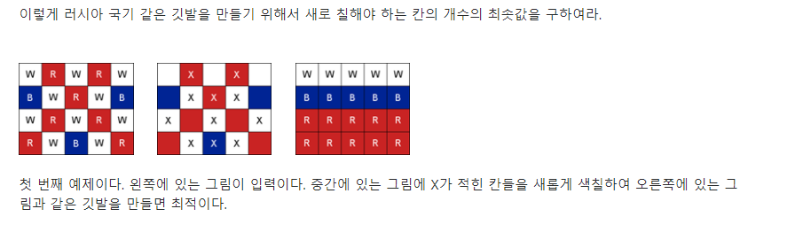

## String Pattern

> String에 주어진 Pattern을 찾는 문제
>
> ## 1. Brute Algorithm
>
> 주어진 String을 모두 검색해 나아간다.
>
> ```python
> def BruteForce(pattern, text):
>     
>     N = len(text) #text_len
>     M = len(pattern) #pattern_len
>     
>     i = 0 #text_idx
>     j = 0 #pattern_idx
>     
>     while j < M and i < N:
>         if pattern[j] != text[i]:
>             i -= j
>             j = -1
>         i+=1
>         j+=1
>     if j == M:return i-j
>     else:return -1
> 
> ```
>
> ## 2. KMP Algorithm
>
> 


## N 개의 영역과 각 영역의 합

> ### ***2개의 영역부터 시작해보자.***
>
> 길이 N의 리스트 T를 두 개의 영역을  A,B로 나누면 
>
> A의 인덱스 `i` 0 -> N-1 는 `A[0:i]`  , B의 인덱스는 `j`는 i+1 -> N `B[i+1:N]` 이다.
>
> A의 영역 합은 0부터 i까지 반복문을 통해, B의 영역 합은 i+1부터 N-1까지 반복문을 통해 구할 수 있다.
>
> 하지만 이는 반복문을 사용하기에 중복된 연산을 수행한다. 
>
> 
>
> ### ***중복 연산을 줄여보자***
>
> 리스트 S를 생성한다. 리스트 S[i] 는 T의 인덱스 0부터 i까지의 합을 저장하고 있다.
>
> A영역의 합
>
> - 리스트 T의 영역 0 -> i 까지의 합은 S[i]
>
> B영역의 합
>
> - 리스트 T의 영역 i+1 -> N-1 까지의 합은 S[N-1] - S[i]
>
> 이를 통해 T를 인덱스 i를 기준으로 나눈다 할 때, A영역과 B영역의 합은 `S[i]`, `S[N-1]-S[i]` 로 반복문 한 번을 통해 구할 수 있다.
>
> 특히, 몇 개의 영역만을 구하라 할 때는 이것이 훨씬 유리하다.
>
> 
>
> ### ***3개의 영역 나누기***
>
> 왼쪽 영역의 인덱스 i는 0 -> N-3 가운데 영역의 인덱스 j는 i+1 -> N-2  오른쪽 영역의 인덱스는 j+1 -> N-1
>
> 각 영역의 합은 위의 중복연산을 줄이는 방법으로 구해보면 `S[i], S[j]-S[i], S[N-1]-S[j]`
>
> 
>
> ### ***예제로 풀어보기*** [SWEA](https://swexpertacademy.com/main/talk/solvingClub/problemView.do?contestProbId=AWQl9TIK8qoDFAXj&solveclubId=AXQfxoN6iyIDFAQT&problemBoxTitle=Club+Problem+box+01&problemBoxCnt=1&probBoxId=AXQfxoN6iyMDFAQT)
>
> 
>
> 위의 문제는 주어진 행을 3개의 영역으로 나눠 변화가 최소가 되게 하는 구간을 찾는 문제다. 입력으로 N ,M 과 각 행의 알파벳이 str type으로 주어진다. 세 가지 색별로 각각의 행에서 변화가 필요한 수를 누적합으로 기입한다. 그리고  i와 j의 범위 변화를 주면서 세 영역을 변화시킨다. 각 영역에서 색 변화가 가장 작은 값을 저장해 출력하면 된다. 
>
> ```python
> N,M = map(int,input().split())
> W = [0]*N
> B = [0]*N
> R = [0]*N
> flag = [input() for _ in range(N)]
> for idx,line in enumerate(flag):
>     for element in line:
>         if element != 'W':
>             W[idx]+=1
>         if element != 'B':
>             B[idx]+=1
>         if element != 'R':
>             R[idx]+=1
>     if idx != 0:
>         W[idx]+=W[idx-1]
>         B[idx] += B[idx - 1]
>         R[idx] += R[idx - 1]
> MIN = N*M
> for i in range(N-2):
>     for j in range(i+1,N-1):
>         SUM = W[i]+B[j]-B[i]+R[N-1]-R[j]
>         if MIN>SUM:
>             MIN = SUM
> print('#{} {}'.format(t+1,MIN))
> ```
>
> 


