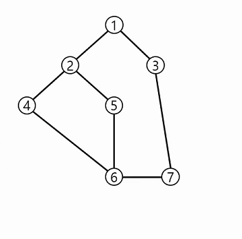

## 1. 피보나치 수열

>  ### 재귀호출
>
> ```python
> def fibo(n):
>     if n == 0 :
>         return 0
>     elif n==1:
>         return 1
>     else:
>         return fibo(n-1)+fibo(n-2)
>     
> ```
>
> 
>
> ### Memoization
>
> 재귀호출의 중복적인 호출을 방지하기 위해서 값을 저장해 저장한 값을 불러오는 방법
>
> ```python
> def fibo(n):
>     if memo[n]==-1:
>         memo[n] = fibo(n-1) + fibo(n-2)
>     return memo[n]
> 
> memo = [-1]*(N+1)
> memo[0], memo[1] = 0,1
> ```

## 2. DFS

깊이 우선 탐색, 출발점에서 점점 멀어지는 방향으로 탐색하는 방법 최대한 멀리 갔다가 다시 돌아오는? 반복문을 사용해 깊이 우선 탐색을 할 때 마지막 분기점으로 돌아가기 위해서 Stack을 사용한다. 재귀를 사용하면 재귀의 각 호출 단계가 분기점이기 때문에, Stack이 필요 없다.

> ### 노드 탐색
>
> 
>
> 
>
> 노드 수, 간선 수 주어지고, 간선은 두 노드의 짝으로 입력이 주어질 때, 모든 노드를 탐색하는 방법
>
> **key method**
>
> - 입력된 노드를 중심으로 주변 노드를 방문 했는지 체크하는 `visited` 리스트를 통해서 중복을 없앤다. 
>
> - 탐색하고자 하는 중심 노드의 주변에 방문하지 않은 노드가 있다면 재귀 호출을 통해, 탐색 노드를 중심 노드로 설정하고, `visited = True` 후 같은 방법으로 반복 탐색을 실시한다.
>
> **재귀호출**
>
> ```python
> def dfs(v):
>     visited.append(v)
>     print(v,end=' ')
>     for w in range(1,V+1):
>       if arr[v][w] == 1 and w not in visited:
>           dfs(w)
> 
> V,E = map(int,input().split())
> arr = [[0]*(V+1) for _ in range(V+1)]
> 
> for i in range(E):
>     st, ed = map(int,input().split())
>     arr[st][ed] = arr[ed][st] = 1
> 
> visited = []
> dfs(1)
> ```
>
> **반복문**
>
> ```python
> V,E = map(int,input().split())
> arr = [[0]*(V+1) for _ in range(V+1)]
> 
> for i in range(E):
>     st, ed = map(int,input().split())
>     arr[st][ed] = arr[ed][st] = 1
> 
> visited = []
> stack = []
> stack.append(1)
> 
> while len(stack)!=0:
>     v = stack.pop()
>     if v not in visited:
>     	print(v,end=' ')
>     	for i in range(1,V+1):
>             if arr[v][i]==1 and i not in visited:
>                 stack.append(i)
> ```


## python 문법

> 함수의 이름을 str로 받아 그 함수를 실행하고 싶을 때 `locals()[]()` 를 이용한다
>
> ```python
> def push(X):
>     stack.append(X)
> 
> 
> def pop():
>     if stack:
>         element = stack.pop()
>         print(element)
>     else:print(-1)
>         
> commands = [['push', '1'],['pop']]
> for command in commands:
>     param = command[0]
>     
>     if param != 'push':
>         locals()[param]()
>     else:
>         locals()[param](command[1])
> ```