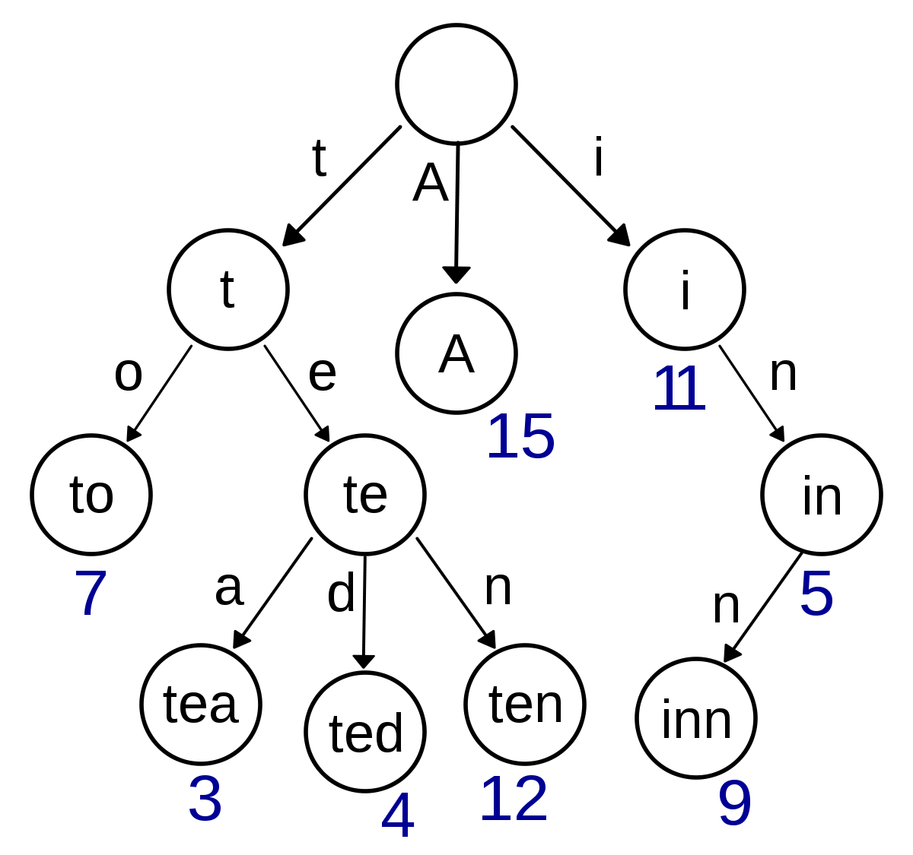

## 1. Trie 자료구조

>  문제를 풀기 위해서 알아야하는 자료구조
>
> 아직 알아야할게 너무 많다는 것을 느꼈다.
>
> 
>
> 위와 같은 형태로 자료를 저장하여, 문제에서 요구하는 사항을 출력하기 위해서 각 노드에 count 변수를 둔다. 또한 와일드 카드에서 `'?'` 가 접두가 아닌 접미로 있을 때를 위해 reversed word를 만들어 준다. 
>
> ```python
> class Node:
>     def __init__(self):
>         self.child = {}
>         self.count = 0
> 
> 
> class Trie:
>     def __init__(self):
>         self.head = Node()
> 
>     def insert(self,word):
>         tmp = self.head
>         for char in word:
>             if char not in tmp.child:
>                 tmp.child[char] = Node()
>             tmp = tmp.child[char]
>             tmp.count+=1
> 
> 
>     def search(self,word):
>         cnt = 0
>         if word == '':
>             for value in self.head.child.values():
>                 cnt+=value.count
>             return cnt
> 
>         tmp = self.head
>         for char in word:
>             if tmp.child.get(char):
>                 tmp = tmp.child[char]
>                 cnt = tmp.count
>             else:
>                 return 0
>         return cnt
>     
> def solution(words, queries):
>     foward_words = [Trie() for i in range(10001)]
>     reverse_words = [Trie() for i in range(10001)]
> 
>     for word in words:
>         foward_words[len(word)].insert(word)
>         reverse_words[len(word)].insert(word[::-1])
> 
>     answer = [0 for _ in range(len(queries))]
>     for index,query in enumerate(queries):
>         if query[0] != '?':
>             q =query.split('?')[0]
>             answer[index] = foward_words[len(query)].search(q)
>         else:
>             q = query.split('?')[-1]
>             answer[index] = reverse_words[len(query)].search(q[::-1])
> 
>     return answer
> ```
>
> 