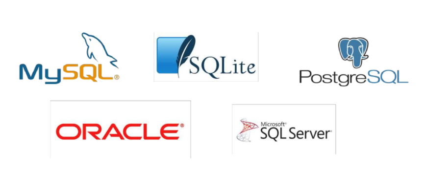

## 0. DB

> - Database : 데이터베이스는 여러 사람이 공유하여 사용할 목적으로 체계화해 통합 관리하는 데이터의 집합
>
> - DBMS : 데이터베이스를 관리하는 시스템
>
> #### RDBMS (관계형 데이터베이스)
>
> 
>
> 열과 행으로 이루어진 테이블 집합으로 구성한다. 각 열을 특정 종류의 데이터를 기록한다.
>
> #### 기본용어
>
> - 스키마 : 데이터베이스에서 자료의 구조와 제약 조건에 관한 전반적인 명세
> - 테이블 : 열과 행의 모델을 사용해 조직된 데이터 요소들의 집합
> - 열(column) : 각 열에는 고유한 데이터 형식이 있다.
> - 행(row),레코드 : 테이블의 데이터는 행으로 저장된다.
> - PK(기본키) : 각 행의 고유값으로 저장된 레코드를 고유하게 식별하는 값


## 1. SQL (Structured Query Language)

> RDBMS의 데이터 관리를 위해 설계한 특수 목적의 언어 자료 검색, 관리, 스키마 생성과 수정 등을 수행한다.
>
> #### 기본 구조
>
> ```sqlite
> 조회
> SELECT * FROM table;
> 중복 없이 가져오기 파이썬의 set와 비슷
> SELECT DISTINCT column FROM table;
> 
> 생성
> CREATE TABLE table(
>     column1 data_type,
>     column2 data_type,
> );
> 
> 삭제
> DROP TABLE table;
> 
> 삽입
> INSERT INTO table (column1,column2, ...) VALUES (value1,value2, ...)
> 
> 조건에 맞는 레코드 조회
> SELECT * FROM table WHERE condition;
> SELECT column1 FROM table WHERE condition;
> 
> 레코드 삭제
> DELETE FROM table WHERE condition;
> 
> 레코드 수정
> UPDATA table SET column1=value1 WHERE condition;
> ```
>
> 
>
> #### 특정 조건으로 오름차순, 내림차순, 몇 개의 데이터를 조회할지 설정하기
>
> ```sqlite
> SELECT column FROM table WHERE condition ORDER BY column ASC/DESC LIMIT num OFFSET num;
> ```
>
> 
>
> #### 표현식
>
> ```sqlite
> 특정 테이블 특정 레코드 수
> SELECT COUNT(column) FROM table;
> 
> 특정 테이블에 특정 레코드의 평균
> SELECT AVG(column) FROM table;
> 
> 특정 테이블에 특정 레코드의 합
> SELECT SUM(column) FROM table;
> ```
>
> 
>
> #### LIKE
>
> 와일드카드 `%`, `_` 
>
> `2%` : 2로 시작하는 값
>
> `%2` : 2로 끝나는 값
>
> `%2%` : 2가 들어가는 값
>
> `_2%` : 두번째가 2인 값
>
> `1____`: 1로 시작하고 4자리인 값
>
> `2_%_%` 2로 시작하고 적어도 3자리인 값
>
> ```sqlite
> SELECT * FROM table WHERE column LIKE 'pattern';
> ```


## 2. SQL in django

> ```python
> from django.db import models
> 
> class User(models.Model):
>     first_name = models.CharField(max_length=20)
>     last_name = models.CharField(max_length=20)
>     age = models.IntegerField()
>     country = models.CharField(max_length=20)
>     phone = models.CharField(max_length=20)
>     balance = models.IntegerField()
> ```
>
> .
>
> #### 기본구조
>
> ```python
> #조회
> User.objects.all()
> #중복 없이 가져오기 파이썬의 set와 비슷
> SELECT DISTINCT column FROM table;
> 
> 
> #조건에 맞는 레코드 조회
> User.objects.filter(age=19)
> User.objects.filter(age__lte=40).values('id','balance')
> User.objects.filter(last_name='김',balance__gte=500).values('first_name')
> User.objects.filter(first_name__endswith='수',country='경기도').values('balance')
> User.objects.filter(Q(age__lte=40)|Q(balance__gte=2000)).count() 
> User.objects.filter(phone__startswith='010').count()
> #조건의 레코드 삭제
> user = User.objects.get(pk=12)
> user.delete()
> 
> #레코드 수정
> user = User.objects.get(pk=12)
> user.age=21
> user.save()
> 
> user = User.objects.filter(first_name='옥자',last_name='김').get()
> user.country = '경기도'
> user.save()
> 
> ##### 특정 조건으로 오름차순, 내림차순, 몇 개의 데이터를 조회할지 설정하기
> User.objects.order_by('-balance')[0:4]
> User.objects.filter(phone__icontains='123')
> 
> ```
>
> 


