​	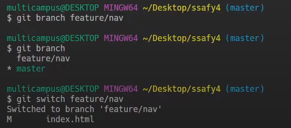

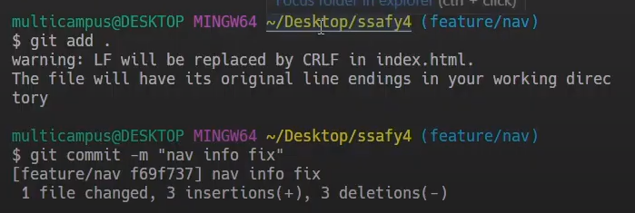

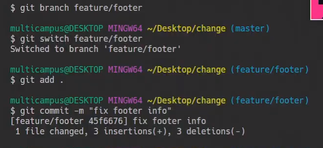

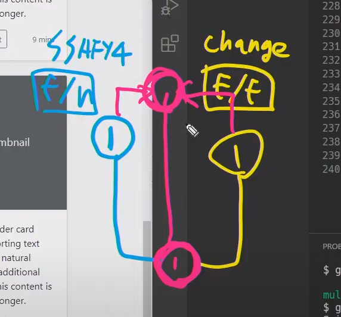

## GitLab Flow, Github Flow

로컬장소가 아닌 온라인에서 merge하는 방법 merge request, pull request(pr)

`create` `branch ` `merge request` `code review` `deploy` `merge to master`

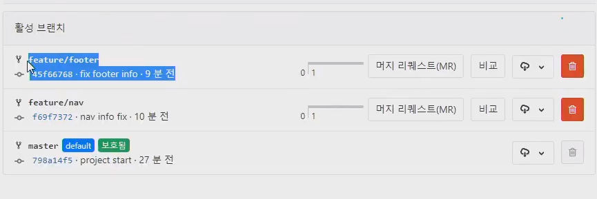

비교는 master와 얼마나 다른지 보여준다

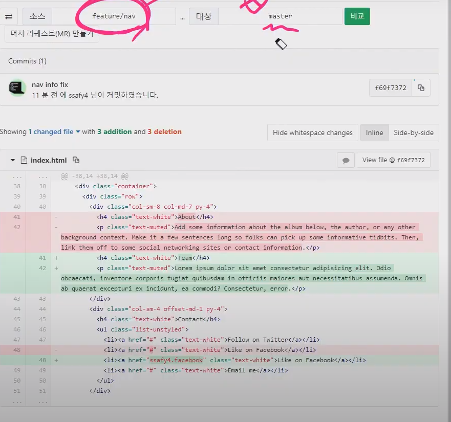

머지리퀘스트를 누른다. 

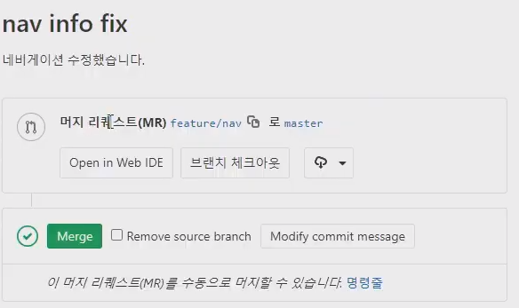

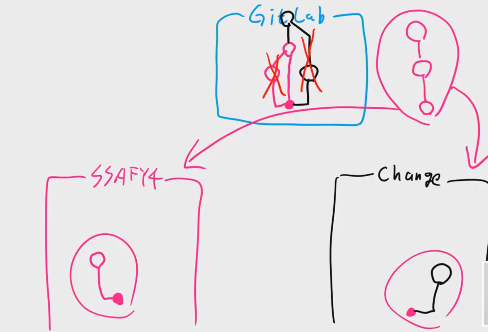

머지리퀘스트를 완료했으면 다시 master를 가져오고 원래 하던 브랜치를 삭제한다. 

git pull origin master 후

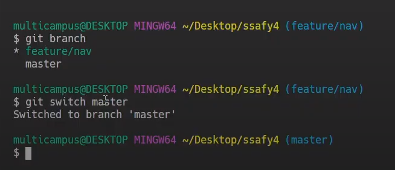

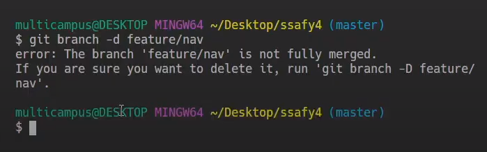

서로 다른 브랜치가 서로 같은 코드를 수정할 때 충돌이 난다

충돌 해결을 누르면 어떤 것을 선택할지 보여준다

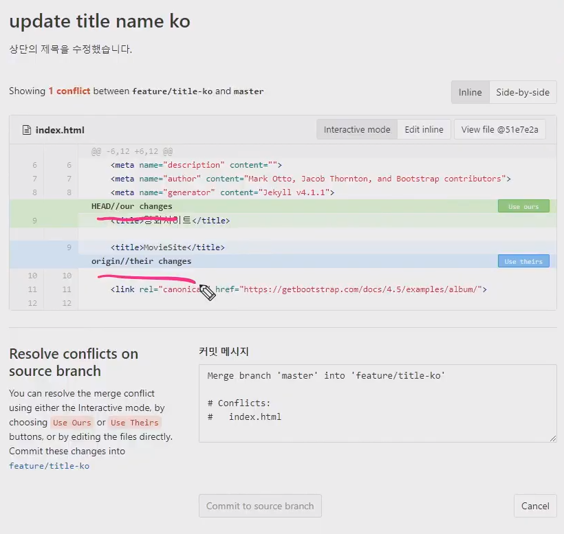

프로젝트에서 같은 팀이 아닌 서로 다른 팀일 때  `Fork` 를 사용한다. (권한이 없는 사람의 저장소로 프로젝트를 가져온다)

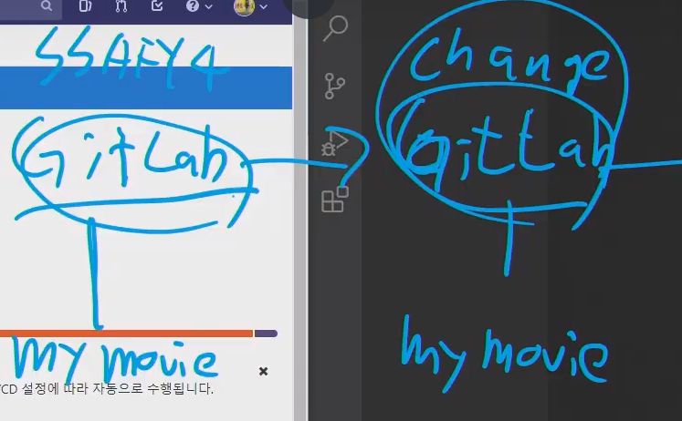

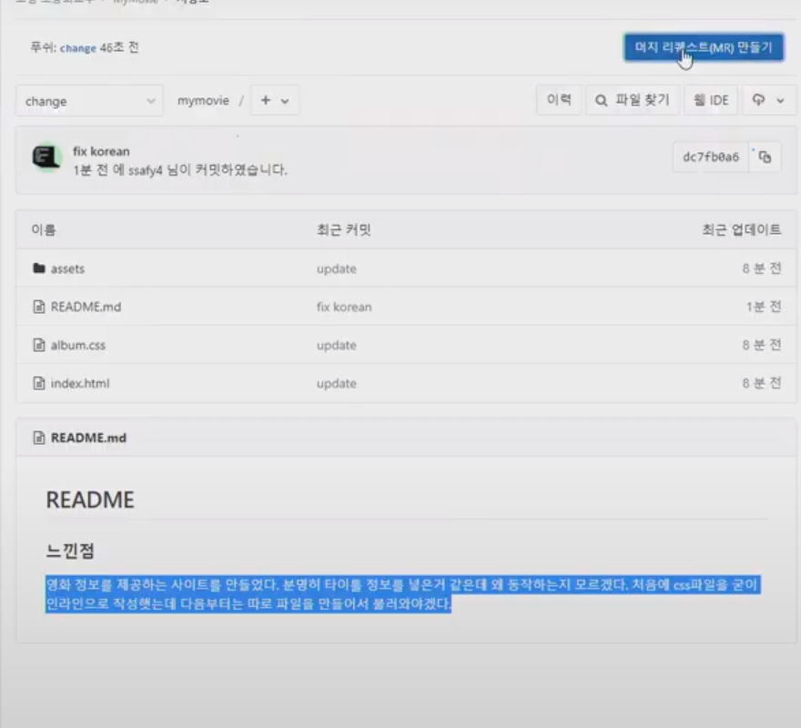

틀린 부분을 수정하고 머지리퀘스트를 보낸다 (여기 수정이 필요할 것 같아 제가 했어요 반영해주실래요 ? )

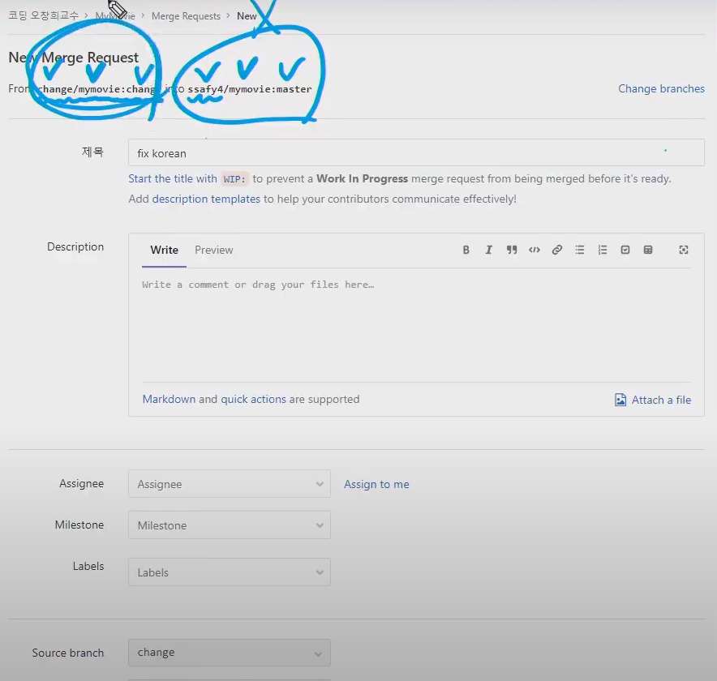

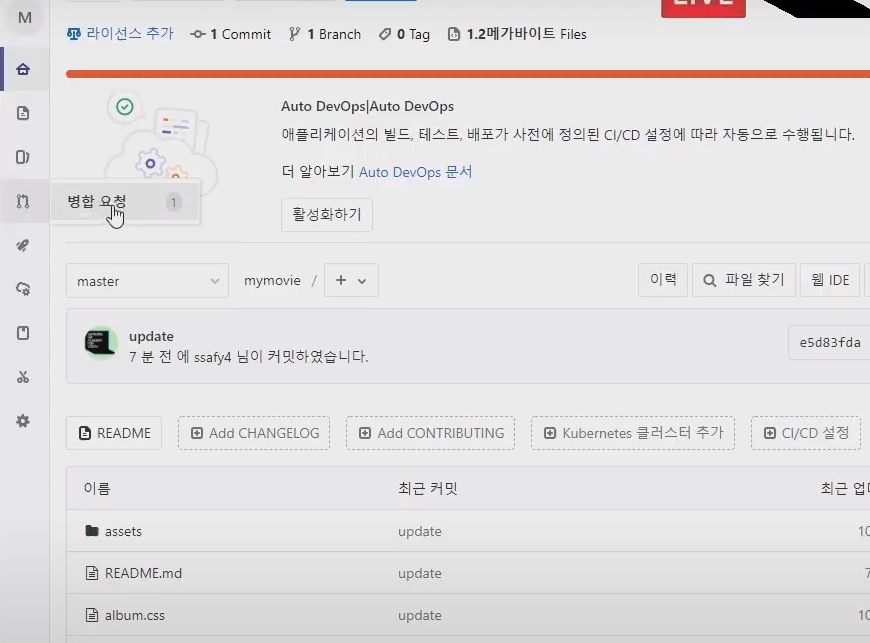

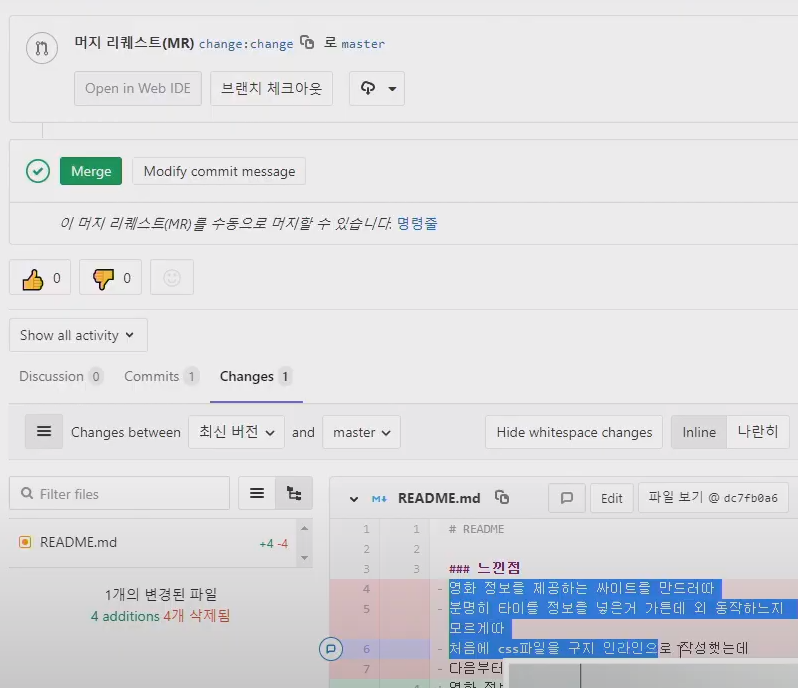

## pjt

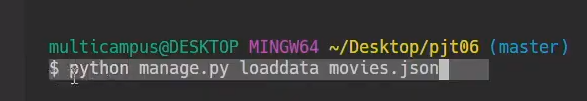

