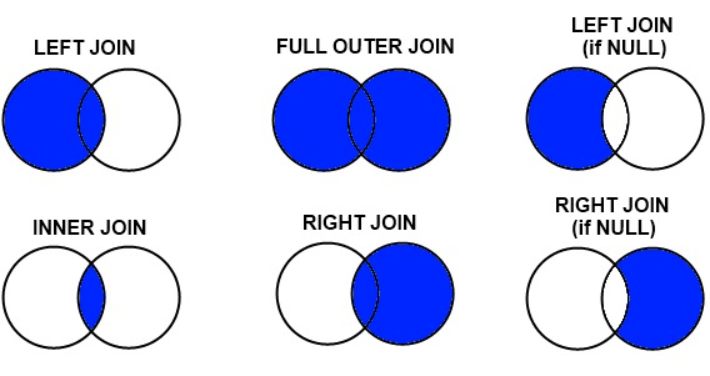

## MYSQL


## 1. SELECT

>```mysql
>#ANIMAL_ID로 오름차순 정렬된 것들 모든 필드를 보여주기
>SELECT * FROM ANIMAL_INS ORDER BY ANIMAL_ID ;
>
>#ANIMAL_ID로 내림차순 정렬된 것들 중 이름과 시간 필드 보여주기
>SELECT NAME,DATETIME FROM ANIMAL_INS ORDER BY ANIMAL_ID DESC;
>
>#INTAKE_CONDITION이 'Sick'인 레코드들 중 ID와 이름 필드 보여주기
>SELECT ANIMAL_ID, NAME FROM ANIMAL_INS WHERE INTAKE_CONDITION = 'Sick';
>
>#INTAKE_CONDITION이 'Aged'이 아닌 레코드들 중 ID와 이름 필드 보여주기
>SELECT ANIMAL_ID,NAME FROM ANIMAL_INS WHERE NOT INTAKE_CONDITION = 'Aged' ;
>
>#여러 기준으로 정렬, 그 중 이름은 오름차순, DATETIME은 내림차순으로 정렬한 것 들 중 ID,이름,DATETIME 필드 보여주기
>SELECT ANIMAL_ID,NAME,DATETIME FROM ANIMAL_INS ORDER BY NAME, DATETIME DESC;
>
>#DATETIME으로 오름차순 정렬한 것들 중 첫번째부터 1개 보여주기 
>SELECT NAME FROM ANIMAL_INS ORDER BY DATETIME LIMIT 1;
>
>#ANIMAL_INS 테이블에서 모든 레코드 수 세기
>SELECT COUNT(*) FROM ANIMAL_INS ;
>
>#NAME이 NULL이 아닌 것들 중 중복 NAME을 제외한 것들의 수 세기
>SELECT  COUNT(DISTINCT NAME) FROM ANIMAL_INS WHERE (NAME IS NOT NULL) ;
>```


## 2. GROUP BY

> ```mysql
> #ANIMAL_TYPE 별로 그룹화한다. EX) Dog, Cat,... 그리고 그 수를 보여준다
> SELECT ANIMAL_TYPE, COUNT(ANIMAL_TYPE) 
> FROM ANIMAL_INS 
> GROUP BY ANIMAL_TYPE
> ORDER BY ANIMAL_TYPE;
> ```
>
> ```mysql
> #이름별로 그룹화한다. 조건으로 그 수가 2 이상인 것들을 보여준다.
> SELECT NAME, COUNT(NAME) AS COUNT
> FROM ANIMAL_INS
> GROUP BY NAME
> HAVING COUNT > 1
> ORDER BY NAME;
> ```


## 3. JOIN

> 
>
> ### LEFT JOIN
>
> ```mysql
> #OUTS를 기준으로 ON 조건으로 탐색한다.
> #OUTS의 ID와 같은게 INS의에 있다면 INS 필드는 온전하지만
> #OUTS의 ID가 INS에 없다면 INS의 모든 필드 값은 NULL이 된다.
> #이렇게 INS의 ID가 NULL인 부분을 조건으로하여 OUTS의 ID와 NAME을 보여준다.
> SELECT ANIMAL_OUTS.ANIMAL_ID, ANIMAL_OUTS.NAME
> FROM ANIMAL_OUTS
> LEFT JOIN ANIMAL_INS
> ON ANIMAL_OUTS.ANIMAL_ID = ANIMAL_INS.ANIMAL_ID
> WHERE ANIMAL_INS.ANIMAL_ID is NULL
> ORDER BY ANIMAL_ID;
> ```
>
> ```mysql
> #OUTS를 기준으로 ON 조건으로 탐색한다.
> #OUTS의 ID와 INS의 ID가 같고, OUTS의 DATETIME이 더 작다면 NULL이 아닌 필드 값을 가진다.
> #NULL이 아닌 필드 값을 가진 INS 중 ID, NAME을 DATETIME 순으로 보여준다.
> SELECT ANIMAL_OUTS.ANIMAL_ID, ANIMAL_OUTS.NAME
> FROM ANIMAL_OUTS
> LEFT JOIN ANIMAL_INS
> ON ANIMAL_OUTS.ANIMAL_ID = ANIMAL_INS.ANIMAL_ID and 
> ANIMAL_OUTS.DATETIME < ANIMAL_INS.DATETIME
> WHERE ANIMAL_INS.ANIMAL_ID is NOT NULL
> ORDER BY ANIMAL_INS.DATETIME;
> ```
>
> ```mysql
> #INS를 기준으로 ON 조건으로 탐색한다.
> #INS ID가 있지만 OUTS에 없는 ID 중 DATETIME이 가장 이른 3개를 보여준다.
> SELECT ANIMAL_INS.NAME, ANIMAL_INS.DATETIME 
> FROM ANIMAL_INS
> LEFT JOIN ANIMAL_OUTS
> ON ANIMAL_INS.ANIMAL_ID = ANIMAL_OUTS.ANIMAL_ID
> WHERE ANIMAL_OUTS.ANIMAL_ID is NULL
> ORDER BY ANIMAL_INS.DATETIME LIMIT 3;
> ```
>
> ```mysql
> #INS를 기준으로 ON 조건으로 탐색한다.
> #INS ID와 OUTS ID가 같고, 중성화 여부가 다른 것을 ID순으로 보여준다.
> SELECT ANIMAL_INS.ANIMAL_ID, ANIMAL_INS.ANIMAL_TYPE, ANIMAL_INS.NAME
> FROM ANIMAL_INS
> LEFT JOIN ANIMAL_OUTS
> ON ANIMAL_INS.ANIMAL_ID = ANIMAL_OUTS.ANIMAL_ID
> WHERE ANIMAL_OUTS.ANIMAL_ID IS NOT NULL AND
> ANIMAL_INS.SEX_UPON_INTAKE != ANIMAL_OUTS.SEX_UPON_OUTCOME
> ORDER BY ANIMAL_INS.ANIMAL_ID;
> ```
>
> 