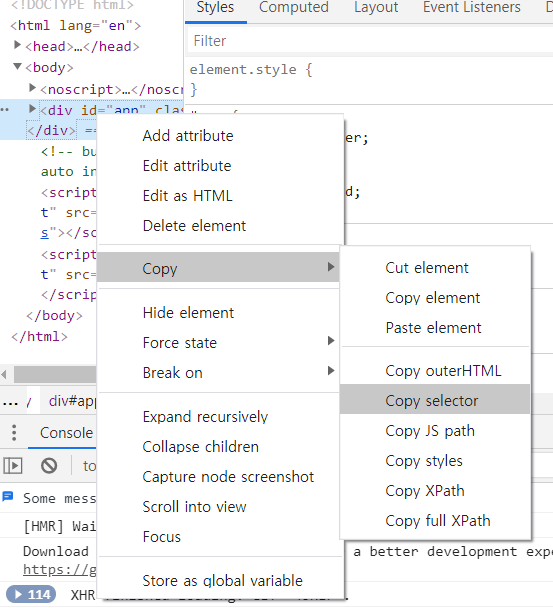

### 11/19  완료한 것

- 계정 만들기 signup
- 계정 로그인 login
- 영화 review  crud


### 11/20 해야할 것

- 영화 review 댓글
- 영화 review 좋아요
- 기본적인 디자인


### 11/20 새로 사용한 것

- `    this.$router.go(this.$router.currentRoute)` : 새로고침처럼 사용 (댓글 작성 시  댓글 목록이 바로 바뀌지 않아서 추가했음)

  

- ```html
  {
      path: '/community/movie_review_detail/:review_id',
      name: 'movie_review_detail',
      component: MovieReviewDetail,
  }, 
  ```

  path를 django에서 variable routing 했던 것 처럼 사용할 수 있다.
   path 에서 :(변수명) 이렇게 ! 이 변수는 어디서 오냐면.. 라우팅을 요청할 컴포넌트 혹은 페이지에서 다음과 같이 요청한다
  this.$router.push({name : 'movie_review_detail', params : {review_id:review.id}})

  


### 11/20 발생한 문제

- username이 아닌 user_id로 나오는것... 댓글과 게시물 등등 작성자 이름을 입력해야하는데 이거 어떻게 해결하지??
  - 내가 생각한 해결책 
  - 1. 로그인할 떄 토큰을 로컬스토리지에 넣은것처럼 username을 로컬스토리지에 저장한다 ->  ***해결***

- axios.post는 무조건,, 데이터를 넘겨줘야해 첫번 째 인자가 데이터이기 때문에 인증오류난다... 원래는 첫번째 인자에 토큰을 넣어줫었느데,, 그거로 시간날림 ,, 내 생각에 like에서 해당 유저가 있는지 확인하고 없으면 추가하기 때문에 post라 생각했고 굳이 데이터를 안넘겨주고 request.user를 사용하려 했기 떄문에 데이터를 쓸 생각 안해서 계속해서 인증오류가 났음
- 도대체 object를 json으로 변환할 수 없다.......뭔소리일까 key값에 넣은것도 아니고 value값으로 object가 안되는 겅가


### 11/21 해야할 것

- 기본 디자인
- 페이지 상속 구조 바꾸기


### 11/21 새로 사용한 것

- querySelector, createElement, appendChild를 이용해 동적인 웹페이지 구현 (하지만 없던 요소가 생기다보니 페이지의 디자인이 뒤틀림 문제 해결방법 생각해 봐야함)
- 버튼 Hover할 때 하위 요소를 보여주는 스타일 적용


### 11/21 발생한 문제

- 동적인 웹페이지 구현할 때 없던 요소가 생기다보니 페이지의 디자인이 뒤틀림 문제 해결방법 생각해 봐야함
- 이미지 혹은 동영상에 window의 scroll event에 따라서 opcaity가 변화하는 css를 적용하려 했는데 잘안된다 img.style.opacity에서 오류가 발생하는데 해결 못하겠음


### 11/22 해야할 것

- 게시판 디자인
- 글 목록을 보여줄 때 최신글 인기글 순서 적용하기
- 게시글 디테일 디자인
- 검색창


### 11/22 새로 사용한 것

- 영화 리뷰 평점 등록할 때 mouserover, mouserout, 사용

- model에서 해당 모델이 foreignkey를 몇개나 가지고 있는지 반환하는 법, 새로운 컬럼을 만든다...

  ```python
  from django.db.models import Count
  annotate(num_likes=Count('like'))
  order_by('-num_likes')
  ```

- z-index를 이용해서 새로 생기는 element를 다른 element와 간섭이 안일어나게 했음


### 11/22 발생한 문제

- axios 비동기 요청에 의해서 브라우저 화면에 좋아요 개수 출력이 안된다.. -> 쿼리셋 자체를 바꾸는 방법


### 11/23 해야할 것

- 로그인, 회원가입 디자인 금방끝남
- 검색 suggestion 혹은 검색어 입력 시 어떤 페이지를 보여줄 것인가 (아마도 영화 detail)
- movie poster  Style 추가 : 마우스 오래 머무르면 poster 확대 되면서 영화 상세정보 간략히 보여주기


### 11/23 새로 사용한 것


### 11/23 발생한 문제

```html
window.location.href=`http://localhost:8080/movie_detail?movie_title=${inputValue}`
this.$router.push({name : 'movie_detail', query : {movie_title :inputValue}})
```

라우터는 같은 페이지에서 이동이 안된다. 그래서 a태그 처럼 이동시켜버렸다


### 11/24 해야할 것

- movie review detail볼 때 밑에 글 목록 보여주기
- 영화 카드에 대한 CSS -> 마우스 오래 머무르면 세부정보 보여주거나 새로운 페이지
- 내 정보 페이지
- 영화정보 더 보여주기 (배우 , 대사)


### 11/24 새로 사용한 것

- 네이버 영화 API 영화 정보

  

  위의 사진 처럼 네이버 영화 정보 사이트의 html요소를 가져오는 방법을 통해서 배우 사진을 가져왔다.
  
  

### 11/24 발생한 문제

- movie review detail볼 때 밑에 글 목록 보여줄 때 router의 특성상 클릭했을 때 새로고침이 안되기 때문에 정보 업데이트가 되지 않았다. 그래서 새로고침으로 바꿈 -> async await를 사용해보자

- scroll event 에서 window.scrollY 의 값이 화면의 크기에 따라 달라질 수 있다.

- 첫 번째 문제와 마찬가지로 로그인 후 추천 영화를 보여줄 때, 로컬저장소에 저장된 정보를 불러와 그 정보를 토대로 추천해야하는데 이 정보가 동기적으로 처리가 되지 않아 문제가 있었다. 그래서  밑의 형식으로 함수를 변경했다. ---> 안된듯??

  ```html
  getFavoriteGenre () {
  	return JSON.parse(localStorage.getItem('favorite_genres'))
  },
  async fetchData() {
  	return await this.getFavoriteGenre()
  }
  created () {
      this.genre = this.fetchData()
      this.getRecommend()
      this.infiniteHandler()
  }
  ```

  

### 11/25 해야할 것

- 관리자 계정 관리자 페이지
- 검색시 클릭으로 페이지 전환, 검색 목록 보면 마우스 커서 손가락으로 바꾸기
- 영화 명대사 옆에 배우 이름
- 글 세부정보 볼때 최소높이 80vh 설정해서 밑에 글 목록이 바로 안보이게 하기
- 글 작성할 때 별 선택되는 색깔만 좀 밝게

- infinite scroll loader 가운데로 오게 하기, 스케일 업 시키기
- 내 정보 ( 내가 쓴 글)


### 11/25 새로 사용한 것

- 스크롤 부드럽게 맨 위로 올라가기

  ```html
  window.scrollTo({top: 0, behavior: 'smooth'});
  ```

- 