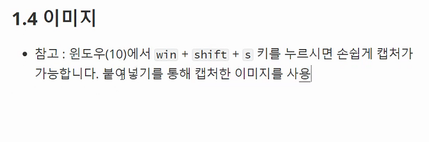

`20년 7월 17일`

# 1. typora

> ### 1.1 '>'를이용하여 막대기 설정
>
> ### 1.2 -하이픈을 이용하여 순서가 없는 목록
>
> ​		- tab키를 이용하여 들여쓰기
>
> ​		- shift tab키를 이용하여 들여쓰기 취소
>
> ### 1.3 ``백틱을 이용하여 강조하고 싶은 부분 표현`
>
> ### 1.4
>
> ```
> ​```백틱을 세 번 입력하고 엔터를 누르면 생성된다.
> ```
>
> ### 1.5 window 키 + shift + s 를 누르면 손 쉽게 캡처가 가능하다
>
> 
>
> ### 1.6 ``을 작성하고 `()`안에 이미지 주소를 입력하면 이미지가 나온다 `[]`안에는 이미지 파일의 이름을 작성한다.
>
> ### 1.7 Link
>
> - `[]()`을 작성하고 `()`안에 링크주소를, `[]`안에 어떤 링크주소인지를 작성하면 된다.
> - [구글](www.google.com)
>
> ### 1.8 Tabel
>
> - `|` (파이프) 사이에 컬럼을 작성하고, enter를 눌러준다.
>
> - 마지막을 `|` 로 끝내주어야한다.
>
> - | 이름 | 성별 | 나이                                  |
>   | ---- | ---- | ------------------------------------- |
>   |      |      | `ctrl`+`enter`를 누르면 행이 추가된다 |
>
> - 

# 2. git에 대하여

git 에는 작업 흐름이 있다.

add : 커밋할 목록에 추가

commit 커밋(create a sanpshot)만들기

push 현재까지의 역사 (commits)가 기록되어 있는 곳에 새로 생성한 커밋들 반영하기


github과 git은 다르다

실제 변경사항 기록을 해주는 친구가 git, 그냥 그 기록을 따로 저장해 주는 친구가 github입니다

